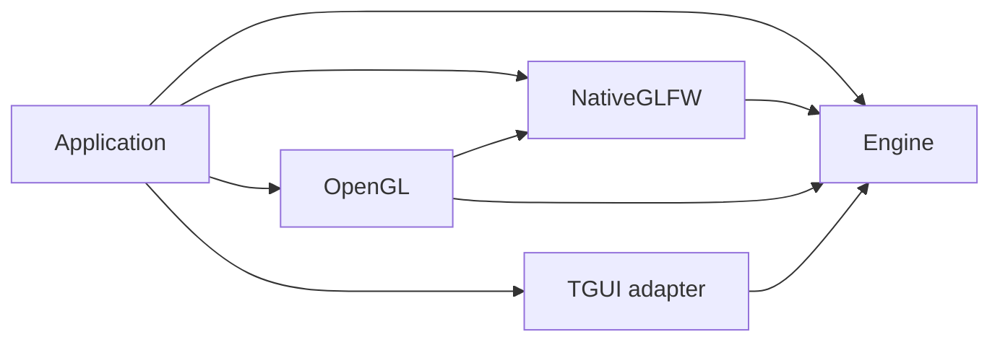

# Engine and integration modules

Cheryl uses one shared engine library and independently selected integration
libraries. Each owner defines its sources, public includes, dependencies and tests.
The repository root selects the assembly; it does not own implementation inventories.

The files `cmake/CherylVersions.cmake`, `CherylOptions.cmake`,
`CherylTargets.cmake`, `CherylOutputs.cmake` and `CherylLinkage.cmake` declare shared
build metadata. Owners consume the version, concrete target name, artifact
`OUTPUT_NAME` and scoped dependency lists while retaining their own source and
composition rules. Cheryl and Engine use version 4.0.0; the demo and existing
modules use independent 1.0.0 versions. Public `Cheryl::...` aliases remain the
composition boundary so a supplied owner's concrete target name can differ.
Declaration files reload variables in each caller's scope; helper function
definitions remain guarded. Standalone entry points load metadata before declaring
their projects or bootstrapping dependencies in local scopes.

Support metadata inserts `_S_` after its owner: Engine uses
`TARGET_LIB_ENGINE_S_LOGGING_CONFIG` and `TARGET_LIB_ENGINE_S_SIGNAL_HANDLERS`,
and OpenGL owns `TARGET_LIB_MODULE_OPENGL_S_GL46`. Corresponding output and
linkage keys use the same owner/support suffix. `gl46` is OpenGL's generated GLAD
support library.

Owners collect their `src/*.cpp` trees with `file(GLOB_RECURSE ...
CONFIGURE_DEPENDS)`. File additions and removals trigger CMake regeneration;
implementation globs stay within the owner's source tree, with tests, support and
generated sources handled by their own targets. Native input collection excludes
`src/core/controls/` when disabled, and the demo includes each toolkit translation
unit only while its public adapter target exists. The shared test runner collects
its top-level `.cpp` files with `GLOB`. First-include header probes name the public
contracts they validate explicitly.

Module owners are grouped by contract role: `platform/` contains display/window/input
implementations, `graphics/` contains rendering/presentation/resource implementations
and `ui/` contains optional toolkit consumers.
[The module index](../../projects/modules/README.md) maps those roles to engine
interfaces; each owner's README maps its concrete types to the contracts it fulfills.

| Target | Owner | Dependencies selected by that owner |
| --- | --- | --- |
| `Cheryl::Engine` (`cengine`) | `projects/engine/` | Threads, GLM, CTTI, spdlog, Backward; private STB/JSON implementation includes. |
| `Cheryl::NativeGLFW` | `projects/modules/platform/native-glfw/` | Engine and GLFW; Gainput and its Linux X11 requirements when native input is enabled. |
| `Cheryl::OpenGL` | `projects/modules/graphics/opengl/` | Engine, Native GLFW, OpenGL and generated GLAD. The entire backend, context binding and factories stay together. |
| `Cheryl::UI::TGUI` | `projects/modules/ui/tgui/` | Engine and TGUI 1.13.0 custom backend with FreeType only. Owns input translation and retained render/resource bridges. |
| `Cheryl::UI::RmlUi` | `projects/modules/ui/rmlui/` | Engine and RmlUi 6.3 Core with FreeType. Owns native document sessions and premultiplied retained rendering. |



Engine has no reverse link to a module. Logging, memory, workers, events, assets
and utilities remain organization within that one engine library. UI consumers
follow the same optional owner model; Steam remains a future integration.

## Select an assembly

The root selects Native GLFW, OpenGL, TGUI and RmlUi by default. Set
`CHERYL_BUILD_NATIVE_GLFW=OFF`, `CHERYL_BUILD_OPENGL=OFF` and
`CHERYL_BUILD_UI_TGUI=OFF` and `CHERYL_BUILD_UI_RMLUI=OFF` for Engine alone.
Select Native GLFW with `CHERYL_BUILD_NATIVE_GLFW=ON` and
`CHERYL_BUILD_OPENGL=OFF`; no Cheryl OpenGL/GLAD discovery occurs in that assembly.
OpenGL requires Native GLFW. The demo is selected only with OpenGL and native input.

`CHERYL_BUILD_UI_TGUI` independently selects the optional TGUI owner. The owner
reuses `TGUI::TGUI`, accepts `CHERYL_TGUI_SOURCE`, uses the pinned `extern/tgui`
submodule or finds an exact TGUI 1.13.0 package without downloading. See its
[module guide](../../projects/modules/ui/tgui/README.md) for the custom/FreeType
dependency contract and current scope. Neither Engine nor another module selects
or links the toolkit implicitly.

`CHERYL_BUILD_UI_RMLUI` selects RmlUi independently and defaults to `ON`.
It reuses `RmlUi::Core`, accepts `CHERYL_RMLUI_SOURCE`, uses the pinned
`extern/rmlui` submodule or finds an exact RmlUi 6.3 package. Its
[module guide](../../projects/modules/ui/rmlui/README.md) describes the stock
FreeType dependency contract. Selecting either UI owner does not select the other.

An Engine-only consumer links `Cheryl::Engine`. Native graphics applications use:

```cmake
target_link_libraries(game PRIVATE Cheryl::Engine Cheryl::NativeGLFW Cheryl::OpenGL)
```

This changes the old combined-archive contract: linking `Cheryl::Engine` alone no
longer supplies concrete GLFW/Gainput or OpenGL implementations. Raw archive users
must add the selected module archives and their dependencies. There is no combined
compatibility archive. All public granular include spellings remain available through
their owner's target. Engine's `cheryl/core.h`, `core/controls.h` and `core/display.h`
umbrellas are neutral; select native classes with explicit headers or
`cheryl/backends/native-glfw.h`. Consumers inherit include roots, C++23 and logging
policy by linking targets rather than listing another owner's directories.

`CHERYL_NATIVE_INPUT=OFF` omits Gainput and the default-input factory overload.
`CHERYL_NATIVE_NULL_PLATFORM=ON` selects GLFW without X11/Wayland when Cheryl creates
that dependency. A supplied GLFW target retains its host-selected configuration.
The old `CHERYL_SANDBOX_BUILD=ON` remains a deprecated shorthand for those two
choices; use the explicit native options for new configurations. Engine-only
selection needs neither shorthand nor native platform omissions. Retain the shorthand
until its consumers migrate; mock OpenGL consumers can still need GLFW-null without
Gainput.

Selection preserves owner lifetimes: input detaches while its window is live, GL
resources retire or abandon before context destruction, and runtime worker/frame
shutdown keeps its established ordering.

## Standalone modules

Module and consumer entry points use `CHERYL_REPOSITORY_ROOT` for shared helpers
and Engine dependency bootstrapping. The root configuration sets it automatically;
standalone configurations and enclosing hosts supply the absolute Cheryl checkout
path before adding an owner. There is no alternate `CHERYL_ENGINE_SOURCE` path or
parent-directory fallback. Each module reuses a supplied `Cheryl::Engine` target
or bootstraps Engine from the repository root. OpenGL additionally reuses
`Cheryl::NativeGLFW` or accepts an explicit `CHERYL_NATIVE_GLFW_SOURCE` module
directory. There is no engine source copy, SDK download or forced host cache rewrite.

After explicit build authorization, standalone entry points are:

```sh
cmake -S projects/modules/platform/native-glfw -B build-native-module \
  -DCHERYL_REPOSITORY_ROOT=/path/to/cheryl-engine
cmake -S projects/modules/graphics/opengl -B build-opengl-module \
  -DCHERYL_REPOSITORY_ROOT=/path/to/cheryl-engine \
  -DCHERYL_NATIVE_GLFW_SOURCE=/path/to/cheryl-engine/projects/modules/platform/native-glfw
```

Dependency bootstrapping suppresses root module/demo/test selection in a local
variable scope. Module-local tests remain independently selectable with
`CHERYL_BUILD_TESTS=ON`; they do not enable the engine's broader suites. Supplied
Threads/GLM/CTTI/spdlog/Backward/GLFW/Gainput/OpenGL/GLAD targets are reused where
applicable. Installed `find_package` distribution remains separate work.

New optional owners can start from [the module template](../../cmake/templates/Module.cmake.in).
Replace its project name, alias and uppercase metadata ID, add the corresponding
version/target/output/linkage declarations, declare actual sources and public
include roots, discover only the owner's needed dependencies, and put tests under
that owner. A new target
still requires an actual selection, replacement or dependency-isolation benefit.

## Test ownership and selection

GoogleTest runners use `tests-*` for normal focused tests, `acceptance-*` for broader
or environment-dependent acceptance tests, and `all-*` for all GoogleTests owned by
a subsystem/module. `all-tests` contains all GoogleTests in the selected Cheryl
assembly.

These are build target identities and CTest prefixes. Executable names come from
[CherylOutputs.cmake](../../cmake/CherylOutputs.cmake): for example, `tests-engine`
produces `tests-engine`, `acceptance-engine` produces `tests-acceptance-engine`,
and `all-tests` produces `tests-all`. Manual logging/signal drivers use their
declared output names as well. Archives and executables retain their build-root
output directories.

`CHERYL_BUILD_TESTS=ON` builds the inexpensive `tests-engine`, `tests-logging`
and selected module unit runners. Engine unit cases exercise real
engine-owned bindings, frames and runtime code with controlled contract adapters.
They have no native module link or display/device requirement. The new small runtime
scenario covers input-to-frame transfer, presentation, teardown and session rejection;
the larger runtime fault/concurrency cases remain engine-owned acceptance.

Each module owns its real implementation tests: `tests-native-glfw`,
`tests-opengl`, `tests-ui-tgui` and `tests-ui-rmlui` when selected. UI checks use
controlled engine adapters without native platforms or graphics contexts. TGUI
session/runtime checks use its embedded font; RmlUi uses a selected real font
fixture. The assembly owns `tests-ui-coexist` when both adapters are selected;
neither module's tests depend on the other. `acceptance-engine`, `acceptance-opengl`,
`acceptance-logging` and `acceptance-signal` are excluded from the
default build unless `CHERYL_BUILD_ACCEPTANCE_TESTS=ON`. Native GL cases still need the existing explicit
`CHERYL_NATIVE_GL_TESTS=1` opt-in and a usable display. Font fixtures retain their
existing explicit opt-ins. Dummy engine checks do not establish module conformance.

Each owner also provides a complete GoogleTest runner under its `tests/all-tests/`:

| Target | Cases |
| --- | --- |
| `all-engine` | Engine unit, broader Engine acceptance, and logging unit cases. No native/graphics module link. |
| `all-native-glfw` | Native GLFW diagnostics and, when selected, native input mapping cases. |
| `all-opengl` | OpenGL mock cases and, when native input is selected, native graphics acceptance cases. |
| `all-ui-tgui` | The selected TGUI module's cases. |
| `all-ui-rmlui` | The selected RmlUi module's cases. |
| `all-tests` in `projects/tests/` | Every selected owner's GoogleTest cases, plus assembly coexistence checks when both UI owners are selected. |

These aggregates are explicitly buildable. `CHERYL_BUILD_ALL_TESTS=ON` includes
owner aggregates and the combined runner in the default build and CTest discovery.
Focused and aggregate runners have distinct CTest prefixes; select the intended
prefix to avoid executing the same cases through multiple runners. Native/font
opt-ins apply to owner aggregates as well as the combined runner. Manual logging
and fatal-signal drivers remain separate from GoogleTest aggregation.

Each focused suite compiles its cases into one reusable object target. Focused,
owner and combined runners link those objects directly, preserving test registration
and avoiding duplicate case compilation within a configuration. Private test includes
and definitions remain on the case target; one shared runner entry point supplies
each executable's main. No engine consumer receives module test hooks. Output
executables and archives remain at the build root. Standalone modules provide their
own owner aggregate without enabling other owners' test suites.

Each focused/acceptance suite globs its own `src/` tree. Engine cases still under
`tests/all-tests/src/` are collected once and partitioned into the existing focused
and acceptance selections by the owning test directory. External-dependency and
resource cases, diagnostics, event-bus/runtime-adapter/worker-pool cases, and
block/singleton cases remain acceptance-only; the remaining shared cases are
focused unit checks. New Engine cases go in `tests/unit/src/` or
`tests/acceptance/src/` according to their required selection. Native input cases
remain conditional on `CHERYL_NATIVE_INPUT`.

`CHERYL_BUILD_CONSUMER_TESTS=ON` adds the independent Engine and selected module
consumers, including UI owners, with owner-specific first-include header probes.
The engine probes include its neutral umbrellas; module probes link their own
public target and inherit its requirements.

## Crash and exception traces

The Engine target automatically delivers its bootstrap object to final consumers.
It preserves the original scope: builds without `NDEBUG` install
`backward::SignalHandling`; `NDEBUG` builds do not. This direct object delivery avoids
silently dropping an unreferenced initializer from a static archive. The legacy
`Cheryl::SignalHandlers` target remains available, and ordinary Engine consumers need
no extra bootstrap link. Exception/explicit stack capture uses its existing bounded
capture and fallback code in every build, independently of signal installation.

`acceptance-signal` links only Engine and references no engine entry point.
Its manual POSIX driver checks the consumer's actual `NDEBUG` definition, then
raises `SIGABRT` in a child with a 15-second timeout and core files disabled.
The Debug case requires Backward's trace header and a stack frame; the `NDEBUG`
case requires ordinary signal termination without that header. Sanitizer output
alone does not satisfy the Debug check. This is separate from the standalone
Backward dependency check and from exception/explicit trace tests.

After explicit build and test authorization, build the target in the selected
Debug and Release Engine-only directories and run:

```sh
python3 projects/engine/tests/signal-acceptance/signals.py \
  --debug-build build-validation-debug --release-build build-validation-release
```

Either build argument can be supplied alone. The driver never configures or builds;
it executes previously built consumers and is not registered with CTest. Windows
crash-hook behavior requires separate acceptance.

Reusable isolation, composition and manual-check procedures, with environment and
coverage limits, are in [architecture validation](architecture-validation.md).
