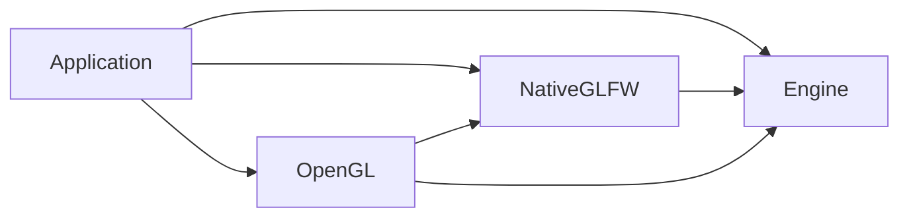

# Engine and integration modules

Cheryl uses one shared engine library and independently selected integration
libraries. Each owner defines its sources, public includes, dependencies and tests.
The repository root selects the assembly; it does not own implementation inventories.

Module owners are grouped by contract role: `platform/` contains display/window/input
implementations and `graphics/` contains rendering/presentation/resource implementations.
[The module index](../../projects/modules/README.md) maps those roles to engine
interfaces; each owner's README maps its concrete types to the contracts it fulfills.

| Target | Owner | Dependencies selected by that owner |
| --- | --- | --- |
| `Cheryl::Engine` (`cherylGL`) | `projects/engine/` | Threads, GLM, CTTI, spdlog, Backward; private STB/JSON implementation includes. |
| `Cheryl::NativeGLFW` | `projects/modules/platform/native-glfw/` | Engine and GLFW; Gainput and its Linux X11 requirements when native input is enabled. |
| `Cheryl::OpenGL` | `projects/modules/graphics/opengl/` | Engine, Native GLFW, OpenGL and generated GLAD. The entire backend, context binding and factories stay together. |



Engine has no reverse link to a module. Logging, memory, workers, events, assets
and utilities remain organization within that one engine library. Future UI/Steam
integrations use the same optional owner convention when their consumers are selected.

## Select an assembly

The root defaults to today's native/OpenGL assembly. Set both
`CHERYL_BUILD_NATIVE_GLFW=OFF` and `CHERYL_BUILD_OPENGL=OFF` for Engine alone.
Select Native GLFW with `CHERYL_BUILD_NATIVE_GLFW=ON` and
`CHERYL_BUILD_OPENGL=OFF`; no Cheryl OpenGL/GLAD discovery occurs in that assembly.
OpenGL requires Native GLFW. The demo is selected only with OpenGL and native input.

An Engine-only consumer links `Cheryl::Engine`. Native graphics applications use:

```cmake
target_link_libraries(game PRIVATE Cheryl::Engine Cheryl::NativeGLFW Cheryl::OpenGL)
```

This changes the old combined-archive contract: linking `Cheryl::Engine` alone no
longer supplies concrete GLFW/Gainput or OpenGL implementations. Raw archive users
must add the selected module archives and their dependencies. There is no combined
compatibility archive. All public granular include spellings remain available through
their owner's target. Engine's `cheryl/core.h`, `core/controls.h` and `core/display.h`
umbrellas are neutral; select native classes with explicit headers or
`cheryl/backends/native-glfw.h`. Consumers inherit include roots, C++23 and logging
policy by linking targets rather than listing another owner's directories.

`CHERYL_NATIVE_INPUT=OFF` omits Gainput and the default-input factory overload.
`CHERYL_NATIVE_NULL_PLATFORM=ON` selects GLFW without X11/Wayland when Cheryl creates
that dependency. A supplied GLFW target retains its host-selected configuration.
The old `CHERYL_SANDBOX_BUILD=ON` remains a deprecated shorthand for those two
choices; use the explicit native options for new configurations. Engine-only
selection needs neither shorthand nor native platform omissions.

## Standalone modules

Each module can reuse a supplied `Cheryl::Engine` target or bootstrap an explicit
`CHERYL_ENGINE_SOURCE` checkout. OpenGL additionally reuses `Cheryl::NativeGLFW` or
accepts an explicit `CHERYL_NATIVE_GLFW_SOURCE` module directory. There is no engine
source copy, SDK download, parent-directory assumption for dependency bootstrapping,
or forced host cache rewrite. A supplied Engine target publishes its source metadata;
foreign/imported targets without it need the explicit source checkout for helpers.

After explicit build authorization, standalone entry points are:

```sh
cmake -S projects/modules/platform/native-glfw -B build-native-module \
  -DCHERYL_ENGINE_SOURCE=/path/to/cheryl-engine
cmake -S projects/modules/graphics/opengl -B build-opengl-module \
  -DCHERYL_ENGINE_SOURCE=/path/to/cheryl-engine \
  -DCHERYL_NATIVE_GLFW_SOURCE=/path/to/cheryl-engine/projects/modules/platform/native-glfw
```

Dependency bootstrapping suppresses root module/demo/test selection in a local
variable scope. Module-local tests remain independently selectable with
`CHERYL_BUILD_TESTS=ON`; they do not enable the engine's broader suites. Supplied
Threads/GLM/CTTI/spdlog/Backward/GLFW/Gainput/OpenGL/GLAD targets are reused where
applicable. Installed `find_package` distribution remains separate work.

New optional owners can start from [the module template](../../cmake/templates/Module.cmake.in).
Replace its name/alias, declare actual sources and public include roots, discover
only the owner's needed dependencies, and put tests under that owner. A new target
still requires an actual selection, replacement or dependency-isolation benefit.

## Test ownership and selection

GoogleTest runners use `*-tests` for normal focused tests, `*-acceptance` for broader
or environment-dependent acceptance tests, and `*-all` for all GoogleTests owned by
a subsystem/module. `all-tests` contains all GoogleTests in the selected Cheryl
assembly.

`CHERYL_BUILD_TESTS=ON` builds the inexpensive `engine-tests`, `logging-tests`
and selected module unit runners. Engine unit cases exercise real
engine-owned bindings, frames and runtime code with controlled contract adapters.
They have no native module link or display/device requirement. The new small runtime
scenario covers input-to-frame transfer, presentation, teardown and session rejection;
the larger runtime fault/concurrency cases remain engine-owned acceptance.

Each module owns its real implementation tests: `native-glfw-tests` and
`opengl-tests`. `engine-acceptance`, `opengl-acceptance`,
`cheryl-logging-acceptance` and `cheryl-signal-acceptance` are excluded from the
default build unless `CHERYL_BUILD_ACCEPTANCE_TESTS=ON`. Native GL cases still need the existing explicit
`CHERYL_NATIVE_GL_TESTS=1` opt-in and a usable display. Font fixtures retain their
existing explicit opt-ins. Dummy engine checks do not establish module conformance.

Each owner also provides a complete GoogleTest runner under its `tests/all-tests/`:

| Target | Cases |
| --- | --- |
| `engine-all` | Engine unit, broader Engine acceptance, and logging unit cases. No native/graphics module link. |
| `native-glfw-all` | Native GLFW diagnostics and, when selected, native input mapping cases. |
| `opengl-all` | OpenGL mock cases and, when native input is selected, native graphics acceptance cases. |
| `all-tests` in `projects/tests/` | Every selected owner's GoogleTest cases. |

These aggregates are explicitly buildable. `CHERYL_BUILD_ALL_TESTS=ON` includes
owner aggregates and the combined runner in the default build and CTest discovery.
Focused and aggregate runners have distinct CTest prefixes; select the intended
prefix to avoid executing the same cases through multiple runners. Native/font
opt-ins apply to owner aggregates as well as the combined runner. Manual logging
and fatal-signal drivers remain separate from GoogleTest aggregation.

Each focused suite compiles its cases into one reusable object target. Focused,
owner and combined runners link those objects directly, preserving test registration
and avoiding duplicate case compilation within a configuration. Private test includes
and definitions remain on the case target; one shared runner entry point supplies
each executable's main. No engine consumer receives module test hooks. Output
executables and archives remain at the build root. Standalone modules provide their
own owner aggregate without enabling other owners' test suites.

`CHERYL_BUILD_CONSUMER_TESTS=ON` adds the independent Engine, selected Native GLFW
and selected OpenGL consumers, with owner-specific first-include header probes.
The engine probes include its neutral umbrellas; backend probes link their own module.

## Crash and exception traces

The Engine target automatically delivers its bootstrap object to final consumers.
It preserves the original scope: builds without `NDEBUG` install
`backward::SignalHandling`; `NDEBUG` builds do not. This direct object delivery avoids
silently dropping an unreferenced initializer from a static archive. The legacy
`Cheryl::SignalHandlers` target remains available, and ordinary Engine consumers need
no extra bootstrap link. Exception/explicit stack capture uses its existing bounded
capture and fallback code in every build, independently of signal installation.

`cheryl-signal-acceptance` links only Engine and references no engine entry point.
Its manual POSIX driver checks the consumer's actual `NDEBUG` definition, then
raises `SIGABRT` in a child with a 15-second timeout and core files disabled.
The Debug case requires Backward's trace header and a stack frame; the `NDEBUG`
case requires ordinary signal termination without that header. Sanitizer output
alone does not satisfy the Debug check. This is separate from the standalone
Backward dependency check and from exception/explicit trace tests.

After explicit build and test authorization, build the target in the selected
Debug and Release Engine-only directories and run:

```sh
python3 projects/engine/tests/signal-acceptance/signals.py \
  --debug-build build-validation-debug --release-build build-validation-release
```

Either build argument can be supplied alone. The driver never configures or builds;
it executes previously built consumers and is not registered with CTest. Windows
crash-hook behavior requires separate acceptance. This check is prepared but has
not been built or executed for the extracted graph.

Extraction implementation and static evidence are recorded in
[architecture validation](architecture-validation.md). Historical directory-migration
runs validate their recorded combined graph, not this extracted assembly.
