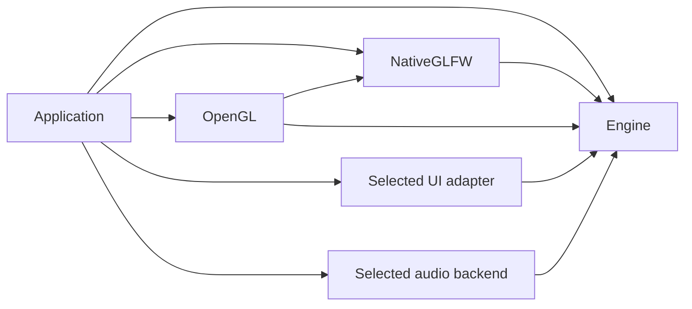

# Engine and integration modules

Cheryl uses one shared `Cheryl::Engine` and independently selected integration
libraries. Each owner declares its sources, public includes, dependencies and tests.
The root selects the assembly. The [module index](../../projects/modules/README.md)
maps owners to Engine contracts and links their APIs; [build options](building.md#configuration-options)
control selection.

Engine has no reverse dependency on an integration. Logging, memory, workers,
events, assets and utilities remain within the one Engine library. Platform owners
implement display/window/input contracts, graphics owners implement rendering and
resources, UI owners consume neutral contracts, and audio owners implement playback.

Command-line bootstrap uses the separate `Cheryl::Startup` and
`Cheryl::OpenGL::Startup` support targets. They add CLI11 and backend argument
definitions to applications that select them; Engine and OpenGL do not depend
back on those targets. See [startup composition](consuming-engine.md#command-line-startup).



## Module boundary criteria

A separate module is justified when it gives an application a concrete choice or
isolation benefit: omitting a dependency, selecting an alternative implementation,
or testing an external integration independently. A directory, internal interface
or small caller count does not by itself justify a library boundary. Cheryl keeps
one shared `Cheryl::Engine`.

Keep the selected Native GLFW, whole OpenGL and independent TGUI/RmlUi owners
cohesive unless a consumer demonstrates a benefit from another boundary. Native
input depends on a live window; dividing display and input splits that coupled
lifetime. OpenGL's context interface permits another window integration within its
owner and does not itself justify context/bridge libraries.

Before introducing another library target, record:

1. the concrete omit/replace/test benefit;
2. the engine contract the owner implements;
3. dependencies that become optional or isolated;
4. lifetime/dependency direction and how cycles are avoided;
5. test ownership and the smallest independent consumer proving the boundary;
6. compatibility consequences for current consumers.

If those points do not identify a real benefit, keep the code inside the existing
owner. Logging, memory, workers, events, general utilities and similar internal
facilities remain engine organization unless a consumer demonstrates otherwise.
Evaluate architectural interfaces by their contract rather than deleting them
because they have few callers.

## Select an assembly

The root defaults to Native GLFW, OpenGL, TGUI and the demo. RmlUi and miniaudio
are optional and default to `OFF`. UI and audio selection is independent of
platform/graphics selection. OpenGL requires Native GLFW; the demo also requires
native input. Disable demo and every module option for Engine alone.

Applications link public targets, for example:

```cmake
target_link_libraries(game PRIVATE Cheryl::Engine Cheryl::NativeGLFW Cheryl::OpenGL)
```

Linking Engine alone supplies neutral contracts, not concrete native/graphics
implementations. Targets propagate public include roots, C++23, logging policy and
dependency requirements; raw archive consumers must supply their complete link
closure. Engine umbrellas remain neutral. Include concrete classes explicitly
through their owner's headers, such as `cheryl/backends/native-glfw.h`.

`CHERYL_NATIVE_INPUT=OFF` omits Gainput and the default-input factory overload.
`CHERYL_NATIVE_NULL_PLATFORM=ON` configures an owned GLFW without X11/Wayland;
a supplied GLFW target keeps its host settings. Prefer these explicit options to
the deprecated sandbox shorthand. The [build guide](building.md) owns their
configuration and dependency details.

Selection preserves owner lifetimes: input detaches while its window is live,
resources retire before context destruction, and runtime shutdown settles workers
and recycles frames before game/adapter cleanup.

## Standalone modules

Standalone entry points require an absolute `CHERYL_REPOSITORY_ROOT` for shared
helpers and Engine bootstrapping. Each owner reuses a supplied `Cheryl::Engine`
or adds Engine from that root. OpenGL also reuses `Cheryl::NativeGLFW` or requires
`CHERYL_NATIVE_GLFW_SOURCE`. Bootstrapping suppresses other owners, demo and Engine
tests in a local variable scope, without rewriting a host's cache.

This builds only the OpenGL owner and its dependencies:

```sh
(
  set -e
  cd "$(git rev-parse --show-toplevel)"
  cmake -S projects/modules/graphics/opengl -B build/opengl-module -G Ninja \
    -DCMAKE_BUILD_TYPE=Release \
    -DCHERYL_REPOSITORY_ROOT="$PWD" \
    -DCHERYL_NATIVE_GLFW_SOURCE="$PWD/projects/modules/platform/native-glfw"
  cmake --build build/opengl-module --target module_opengl --parallel
)
```

Other module directories are standalone source entry points too. Module-local
checks use `CHERYL_BUILD_TESTS=ON` without enabling Engine's broader suites.
Hosts own their root `enable_testing()` policy. Independent consumers use the
owner's `tests/consumer/` entry point. Build-tree composition is supported;
installed/exported package distribution remains future work.

## Add a module

Resolve the boundary criteria above before adding a target. Then:

1. Create an owner under `projects/modules/<role>/<name>/` with `include/`, `src/`
   and `tests/`. Keep public contracts under `include/cheryl/`; implementation
   helpers and SDK details stay private where the API permits it.
2. Copy [Module.cmake.in](../../cmake/templates/Module.cmake.in) into the owner's
   `CMakeLists.txt`. Replace `MODULE_NAME`, the uppercase `MODULE_ID` and public
   `MODULE_ALIAS`. `cheryl_prepare_module()` reuses or bootstraps Engine; pass
   `REQUIRES_NATIVE` only when Native GLFW is a real prerequisite.
3. Declare shared metadata using the same ID in the files below. Add SDK discovery
   inside the selected owner, reusing compatible supplied targets before owned
   sources. Publish required header dependencies with `PUBLIC`; keep private
   implementation dependencies `PRIVATE`. Do not rewrite supplied targets/cache.
4. Declare a root selection with `cheryl_option(name description default_value)`
   in [CherylOptions.cmake](../../cmake/CherylOptions.cmake), and conditionally add
   the owner in the root [CMakeLists.txt](../../CMakeLists.txt). No other module
   should select this owner implicitly.
5. Add owner-local behavior suites and an independent consumer with first-include
   probes. Keep cross-owner cases in `projects/tests/`. Document the public alias,
   dependency selection, lifetime/thread requirements and capability limits in the
   owner's README, and add it to the module index.

| Metadata file | Module declaration |
| --- | --- |
| [CherylVersions.cmake](../../cmake/CherylVersions.cmake) | `VERSION_PROJECT_MODULE_<ID>` |
| [CherylTargets.cmake](../../cmake/CherylTargets.cmake) | `TARGET_LIB_MODULE_<ID>` and test target identities |
| [CherylOutputs.cmake](../../cmake/CherylOutputs.cmake) | `OUTPUT_LIB_MODULE_<ID>` and runner artifact names |
| [CherylLinkage.cmake](../../cmake/CherylLinkage.cmake) | Scoped `LINKAGE_PUBLIC_*` / `LINKAGE_PRIVATE_*` requirements |

Declaration files reload metadata into the caller's scope; helper definitions are
guarded. Load helpers before declaring a standalone project so versions and target
names are available. The template collects only its owner's `src/*.cpp` with
`CONFIGURE_DEPENDS`, making source additions/removals trigger regeneration. Keep
conditional implementations, generated sources and tests in their own selections.

[CherylTests.cmake](../../cmake/CherylTests.cmake) creates an owner aggregate with
`cheryl_add_test_aggregate(... OWNER)`; set `CHERYL_TEST_AGGREGATE` before adding
focused suites through `cheryl_add_test_suite`. Suites compile cases once into
object targets reused by focused, owner and assembly runners. Keep test hooks on
case targets so applications do not inherit them. [Test selection](testing.md)
covers runner options; [architecture validation](architecture-validation.md)
covers isolated graphs, supplied-target reuse and native acceptance.

UI-specific font, alpha, input and publication requirements are in
[Writing a UI adapter](ui-adapters.md).
