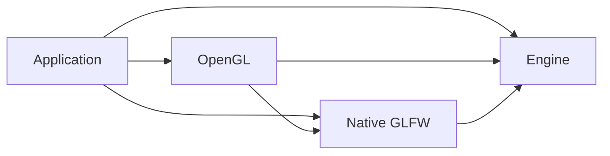

# Groundwork and module extraction plan

2026-10-04. Planning is complete for the initial ownership change; implementation
and executable acceptance remain pending. The agreed boundaries and proposed
`projects/` layout are in [subsystem-modules-plan.md](subsystem-modules-plan.md).

G1–G5 establish ownership, CMake, layout, extraction and isolation. UI then resumes
through U9; input composition and Steam follow when selected as actual consumers.

## Instructions used for this plan

- Plan the minimum changes needed for useful subsystem boundaries. Keep one engine
  library and the entire OpenGL backend in one module. Keep currently coupled GLFW
  window/display and Gainput input together in a native integration module.
- Give every project-owned target an owning directory/CMake definition. Libraries
  own `include/`, `src/` and `tests/`; test targets live beneath their owner. Publish
  public header access through target dependencies, preserving include spellings.
- Inspect actual source, SDK, header, test, startup and shutdown dependencies.
  Separate extraction requirements from later capabilities and speculative cleanup.
- Resolve compatibility and dependency cycles before moves. Sequence coherent
  commits with affected code, acceptance and a discovery boundary for each unit.
  Detail the initial extraction; outline UI/Steam until their consumers are chosen.
- Use ordinary linked libraries, with optional dependency discovery and standalone
  composition against explicitly supplied targets/checkouts. Preserve one input
  provider by default; optional composition needs a demonstrated controller benefit.
- Produce a reviewable plan now. Record future executable checks without running
  them; implementation follows repository safety and shared-working-tree rules.

The revisions from the earlier planning brief are target-owned layout, colocated
tests, target-provided includes, one whole OpenGL module, and no internal target
families. Input composition and Steam service scheduling are later, separate work.

## Decisions and current evidence

Use `projects/` as the working parent name. Confirm that spelling in G1 before
physical moves; it does not affect the dependency design.

The proposed public targets are `Cheryl::Engine`, `Cheryl::OpenGL`, and
`Cheryl::NativeGLFW`. These are roles, not implemented target additions. Keep the
current real engine target name `cherylGL` initially to avoid a simultaneous rename.
After extraction, its archive contains the shared engine implementation. Applications
select integrations explicitly; the normal root build/demo selects today's native
and OpenGL facilities. The actual engine never links back to either module.

This deliberately changes the current full-backend `Cheryl::Engine` link contract.
Backend consumers must add the appropriate module links; raw `libcherylGL.a`
consumers must migrate too. Preserve granular header spellings through their new
owner's include roots. Engine umbrellas become neutral; callers requiring their
former native imports add explicit native headers. G1 records this migration before
implementation. A compatibility facade or combined archive requires an identified
consumer need; it is not assumed by this plan.

Planned native/OpenGL consumer composition:

```cmake
target_link_libraries(game PRIVATE Cheryl::Engine Cheryl::NativeGLFW Cheryl::OpenGL)
```

| Final owner | Existing code and reason |
| --- | --- |
| Engine | Neutral runtime/display/input/render/resource contracts, asset preparation, bindings/routing/snapshots, logging, memory, workers, events and utilities. [EngineContext](../../include/cheryl/core/engine/engine-context.h) already accepts interfaces. No new general runtime facade is needed. |
| Native GLFW | Concrete `Window`/`DisplaySystem`, GLFW diagnostics, `InputSystem`/`InputMapper`/GLFW bindings. [InputSystem](../../src/core/controls/input-system.cpp) requires concrete `Window` and owns native callbacks/polling; splitting them first adds a reverse dependency. Own GLFW, Gainput and their native platform requirements here. |
| OpenGL | All `include/cheryl/backends/opengl*` and `src/backends/opengl/`, including context, GLFW context binding, factories, resources and diagnostics. Own OpenGL discovery and GLAD generation here. Public GL types require public GLAD usage. |
| Test owners | Engine tests and consumer probes under engine; backend tests under OpenGL; native input/GLFW tests under Native GLFW. [input.cpp](../../tests/executables/gtest/core/input.cpp) mixes neutral and native cases and must be split. |

Two concrete seams need attention: [glfw-context.cpp](../../src/backends/opengl/glfw-context.cpp)
includes a private display header by relative path, while
[controls.h](../../include/cheryl/core/controls.h) and
[display.h](../../include/cheryl/core/display.h) import native implementations.
The generic rendering/resource implementation has no equivalent OpenGL dependency.

Extract the native and OpenGL owners in one coordinated cutover after preparation.
Moving native alone first would give Engine (OpenGL factory/context) → Native →
Engine. One cutover avoids that intermediate cycle and a temporary engine-owned
SDK API. It produces two cohesive modules, not one combined graphics/input module:



## Ordered implementation units

### G1 — Freeze ownership and the migration contract

- Inventory every current production/test source, public/private header, target,
  dependency and fixture. Assign exactly one owner before changing source globs.
  Include `gl46`, logging policy, signal-handler objects, demo, Backward tool,
  logging acceptance, consumer and generated header-probe targets. Aliases share
  their real target's directory; vendored projects retain their upstream layout.
- Record the target/header migration above and the chosen parent spelling. Keep
  `all-tests` as a build/executable entry point composed from selected owner suites;
  suite sources remain with their owners. Focused module runners need no new
  production helper libraries. Keep existing logging runner names.
- Assign fixture ownership and output/script paths. Current tests use repository
  `CHERYL_SOURCE_DIR`; the consumer assumes `../..`; Python acceptance expects
  executables at the build root. Inventory those assumptions explicitly.

**Acceptance:** Every existing source/target is accounted for; the final graph is
acyclic; each changed consumer contract has a concrete migration example.
**Boundary:** A required external consumer's archive/link contract may change the
compatibility choice. Settle it here before dependent CMake work.

### G2 — Establish CMake ownership and standalone composition

- Separate root selection/orchestration from owner target definitions, initially
  preserving the current combined implementation. Replace root-recursive source
  discovery with owner-declared inventories. Add one small module template/convention.
  Preserve the current STATIC engine library type.
- Owners publish their own public includes, C++ requirements and dependencies.
  Retain `include/`, legacy `include/cheryl`, public-template internals and `glm.hpp`
  access. Keep source/test hooks private and logging policy consistent across targets.
  Gainput remains PUBLIC while native headers expose its types; STB/JSON stay private.
- Reuse supplied targets or explicit checkout paths in standalone builds. OpenGL
  also needs an explicitly supplied Native GLFW target/checkout. Add dependencies
  once; locally suppress catalog recursion, root demo and aggregate tests when
  bootstrapping only a dependency. Module-local checks remain separately selectable.
  Preserve host settings without forced cache changes.
  Upstream dependencies can remain under `extern/`; their discovery is requested by
  the facility owning them. Do not add install/export or automatic SDK downloads.

**Acceptance:** Static source/target inventory agrees with G1. When authorized,
existing normal/sandbox consumers and tests retain behavior; nested composition
does not duplicate the engine or dependency targets.
**Boundary:** Preserve the supported build-tree contract from U7; a standalone
module must never compile a private copy of engine sources.

### G3 — Move the existing owners without changing subsystem behavior

- Move the current engine into `projects/engine/{include,src,tests}` with its own
  CMakeLists. Move demo/tool/support targets to their recorded directories.
  This engine still contains native/backend code until G4.
- Give existing test targets child directories under their owner. Update fixture,
  acceptance-script, consumer-bootstrap and documentation paths in the same units.
  Owner CMake supplies test sources and scoped private include access to `all-tests`.
- Split mixed neutral/native input cases and classify backend/consumer probes for
  G4. Each move and its CMake/path repairs form one commit; do not reformat moved code.

**Acceptance:** Before/after inventories match, public includes retain their
spellings, and no source depends on the old root path accidentally. Authorized
consumer and representative test runs verify the relocated outputs/fixtures.
**Boundary:** Resolve missing fixtures or unfinished user work before extending it;
do not treat physical relocation as proof of SDK isolation.

### G4 — Cut over the native and whole OpenGL owners

- Move the six coupled native `.cpp` files, their concrete headers and GLFW
  diagnostic implementation into Native GLFW. Leave neutral monitor/window/input
  contracts and binding/publication logic in the engine.
- Move all eleven OpenGL `.cpp` files, private/public headers, umbrella, five
  backend test files and their fixtures into the single OpenGL module. The GLFW
  context and both factory overloads remain there; no bridge/context target is added.
- Replace the private diagnostics reach-through with a small Native GLFW reporting
  declaration. Keep callback installation/restoration and bounded error capture in
  its existing native owner; preserve diagnostic behavior.
- Reassign SDK discovery/linkage and generated GLAD ownership. Engine umbrellas
  stop importing concrete native headers. Split owner consumer/header probes and
  update demo/default composition to explicitly link the selected modules.
- Preserve construction and reverse destruction: input detaches from a live
  window; retained GL resources are retired/abandoned before context destruction;
  runtime worker/frame shutdown ordering remains unchanged.

**Acceptance:** The three selections below work without a target cycle, duplicated
production implementations, global module includes or copied callback managers.
**Boundary:** Keep this ownership cutover coherent. Input-composition features,
renderer redesign and SDK API hiding do not belong in this commit.

### G5 — Prove isolation and replace sandbox's remaining purpose

Run focused checks after explicit authorization, recording each selection separately:

| Selection | Required evidence |
| --- | --- |
| Engine only, ordinary configuration | No OpenGL/GLAD/GLFW/Gainput/native X11 discovery or compilation from disabled modules. Consumer links Engine alone with no handwritten includes/dependencies; first-include checks include neutral umbrellas. Fake runtime/CPU-resource/input and logging checks run without a display. |
| Engine + Native GLFW | No Cheryl OpenGL backend, GLAD generation or explicit OpenGL package requirement. Upstream GLFW retains its own context machinery. Native public headers inherit Gainput requirements correctly; mappings, callback failures, ordering and teardown remain covered. A window-only runtime is not promised by this configuration. |
| Engine + Native GLFW + OpenGL | Module-owned mock GL lifetime/pipeline/program/debug checks, full selected `all-tests`, standalone module composition, and default demo link/run. Native GL checks remain opt-in and are recorded separately from mock checks. |

Preserve the existing logging profile/isolated-process acceptance and native
startup-failure/concurrent-shutdown coverage. [Existing acceptance records](../development/architecture-validation.md)
are a baseline, not evidence for the new graph. Change sandbox to a documented
deprecated selection only after ordinary module selection replaces its dependency-light
tests and native omissions. Remove it in a later cleanup unit once its users migrate.
If mock OpenGL checks still need GLFW-null without Gainput, preserve that choice
as native-module configuration before removing the sandbox option.

### G6 — Prove a UI adapter against the neutral engine

Resume [U9](develop-review-and-development-plan.md#u9-complete-generic-ui-facing-facilities-then-prove-an-adapter)
with a selected consumer. Add only the needed clipping/mesh/input/platform capabilities
to engine contracts; toolkit code and dependencies live in its module with local
tests. The UI adapter submits neutral draw/resource requests and does not select
OpenGL or own the native event pump. Toolkit choice and its requirements matrix are
the discovery gate; extraction does not require every item in the broader UI strategy.

### G7 — Prove optional input composition and Steam session policy with fakes

Separate later commits: collection/publication seam; composed-input policy; independent
service scheduling; SDK-free Steam session/input logic. One provider remains the default.
Sources supply physical or semantic contributions to one coordinator with source/device
identity, retaining the current default binding scope. Per-player APIs wait for a
consumer requirement. Merge held contributions before deriving button edges;
choose explicit absolute-axis policies and consume relative deltas once. Publish one
poll with one latched capture/focus state and observed record order. Never concatenate
complete provider snapshots or let two collectors own the same effective controller.

**Acceptance:** Native-only behavior stays intact; fake native + Steam sources handle
ID collisions, disconnects, focus/capture and immutable prior polls. Holding Jump from
two sources and releasing one keeps Jump held until the final release. A fake application
service progresses while input backlog is full, without rendered frames and through
startup/shutdown failure. Steam session ownership is application-scoped; context leases
do not shut down another user. SDK pumping must follow the [Steamworks lifetime/callback contract](https://partner.steamgames.com/doc/sdk/api)
independently of input admission.

### G8 — Add selected Steam SDK transport and revisit other candidates

Choose SDK/version/application requirements before transport. Keep SDK discovery and
native Steam types inside the Steam module; real-client/controller acceptance is
separate from fake policy checks. Prove controller identification and duplicate-path
suppression before promising per-device Steam/native selection; retain native
keyboard/mouse/text. Direct Steam input
event mode, additional Steam services and runtime loading are later consumer decisions.

Further extraction needs a concrete omit/replace/test benefit: image/font decoding
and JSON manifest loading are possible candidates; another graphics backend must prove
the neutral contracts. GLM, spdlog, CTTI and Backward currently support public engine
contracts and remain engine dependencies. Separating internals, memory, events or workers
into libraries, hiding Gainput with PIMPL, Unicode shaping and installed packaging are
not prerequisites. Record new findings at the unit that actually needs them.

## Evidence and execution rules

CMake [target usage requirements](https://cmake.org/cmake/help/latest/manual/cmake-buildsystem.7.html#target-usage-requirements)
and [public include directories](https://cmake.org/cmake/help/latest/command/target_include_directories.html)
provide consumer access without cross-owner path lists. Current behavior is recorded
in [consuming-engine.md](../development/consuming-engine.md).

For each implementation unit, inspect shared-tree changes, preserve user work, run
only authorized checks, and commit that coherent unit separately. Stop at an unfinished
user-work boundary or revise the plan when an assumption fails. No builds, tests,
physical moves or SDK acquisition were performed for this plan.
