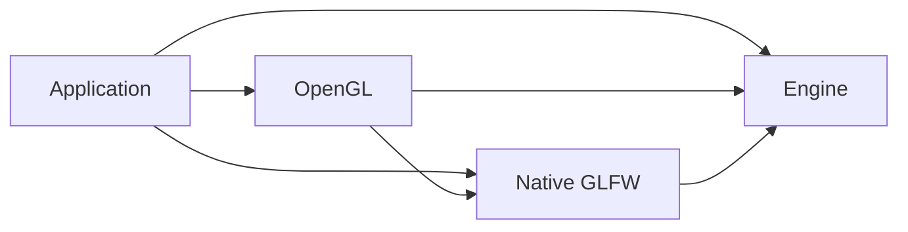

# Groundwork and module extraction plan

2026-10-04. The directory migration established current-target ownership;
Native GLFW and the whole OpenGL backend are now extracted into optional owners.
The original directory-migration acceptance is recorded in
[architecture validation](../development/architecture-validation.md); one native
timing case required a targeted retry. Executable acceptance for the extracted graph
is pending authorization. The agreed boundaries and
`projects/` layout are in [subsystem-modules-plan.md](subsystem-modules-plan.md).

G1–G5 establish ownership, CMake, layout, extraction and isolation. UI then resumes
through U9; input composition and Steam follow when selected as actual consumers.

The original directory-migration sequence was: inventory current owners and preserve compatibility;
move files with owner CMake definitions; repair fixture, consumer, script and document
paths; verify normal/sandbox consumers and selected focused/aggregate checks; commit
the completed migration locally. It covers the directory portion of G1–G3. At that boundary the standalone convention, module selection and test-ownership
changes remained future work. The implementation below now supplies them; executable
isolation and measured default-suite cost still require acceptance.

## Remaining structure implementation — 4 October 2026

The owner requested completion of the module structure today. This resumes the
remaining G1–G5 implementation; UI, Steam and input-composition features remain
later consumers. Builds, compiler/configuration probes and tests require a separate
explicit request. Until then, acceptance is static and executable evidence remains
pending. The owner committed the previously observed edit in engine
`resources/memory.cpp` as `0a72f5c`; preserve that content unchanged.

Implement and commit these coherent units in order:

1. **Ownership and compatibility:** record the production/test inventory below,
   settle selected-module links and the engine-only header contract, and preserve
   the existing engine target name and output locations.
2. **Coordinated extraction:** move Native GLFW and the whole OpenGL implementation,
   move their tests/fixture, split mixed input cases, replace the private diagnostic
   include with a native-owned reporting declaration, and move SDK discovery with
   each owner. Neutral engine umbrellas exclude concrete native classes. The demo
   explicitly links both modules. Preserve existing native/runtime lifetimes.
3. **Composition and test assembly:** supply independent optional selections,
   standalone module entry points and a small reusable convention/template. Keep
   default engine unit cases separate from broader acceptance, assemble `all-tests`
   from the selected owners, and give each module its own consumer/header probes.
4. **Reconciliation and static acceptance:** repair moved references, document the
   link migration and selections, inventory each source and test guarantee, audit
   engine SDK isolation and the target graph, and record outstanding executable
   checks without claiming historical runs validate the extraction.

Standalone initialization and module-local test support share the same CMake owner
initialization. Implementation units 2–3 therefore land in one coordinated cutover,
followed by the separate documentation/static-acceptance unit.

The owner also identified a prior U7 change that made the original crash bootstrap
optional. Restore automatic delivery through `Cheryl::Engine`, retaining the
owner-selected original `NDEBUG` scope. Forward the object to final consumers so
static archive extraction cannot silently omit its initializers. Ordinary exception
trace capture remains independent of signal handling.

The development boundaries are the native/OpenGL cycle (both move together),
unchanged user work (preserve the committed memory edit), and standalone reuse
(never build a second private copy of the engine or mutate the host's cached choices).

| Inventory | Final owner and action |
| --- | --- |
| Eleven `src/backends/opengl/*.cpp`, all their public/private headers and GLAD support | OpenGL; move together, including GLFW context and both factory overloads. |
| `glfw-bindings.cpp`, `input-mapper.cpp`, `input-system.cpp`, `display-system.cpp`, `window.cpp`, `glfw-diagnostics.cpp` and concrete headers | Native GLFW; move together. Keep monitor values, display/window/input interfaces and neutral binding/publication/routing in Engine. |
| Five backend test files and the PNG row-order fixture | OpenGL; mock cases are module unit checks, `native-opengl.cpp` is opt-in composed acceptance. |
| `core/glfw-diagnostics.cpp` test | Native GLFW; preserve callback ownership/containment checks. |
| Two native cases at the end of `core/input.cpp` | Native GLFW; split into a module-owned file. Retain all neutral mapping/tick/state cases in Engine. |
| Dummy-backed display/input/draw/frame contract checks | Engine; exercise real engine-owned logic without native modules. |
| Runtime, workers, memory/construction stress, font fixtures and external-library acceptance | Engine; retain broader implementation acceptance separately from the cheap default suite. User-modified memory source stays at its current engine-owned path. |
| Logging runners, consumer, signal handlers and Backward tool | Existing owners; keep runner/output names, named destinations and the restored Debug crash bootstrap. Split backend header probes into their modules. |

`Cheryl::Engine` contains only the shared engine. Full native graphics consumers
must link `Cheryl::Engine`, `Cheryl::NativeGLFW` and `Cheryl::OpenGL`; raw archive users
must add the module archives/dependencies. Preserve granular include spellings using
each owner's published roots. Native/OpenGL module selection is explicit and disabled
owners do not discover their SDKs. Keep sandbox compatibility as a deprecated native
selection until its remaining GLFW-null/mock use has a documented replacement.

## Instructions used for this plan

- Plan the minimum changes needed for useful subsystem boundaries. Keep one engine
  library and the entire OpenGL backend in one module. Keep currently coupled GLFW
  window/display and Gainput input together in a native integration module.
- Give every project-owned target an owning directory/CMake definition. Libraries
  own `include/`, `src/` and `tests/`; test targets live beneath their owner. Publish
  public header access through target dependencies, preserving include spellings.
- Inspect actual source, SDK, header, test, startup and shutdown dependencies.
  Separate extraction requirements from later capabilities and speculative cleanup.
- Classify tests by the contract or implementation they prove. Plan necessary
  rewrites and coverage replacement as well as directory moves. Keep engine unit
  checks inexpensive; implementing modules own implementation/conformance checks.
- Resolve compatibility and dependency cycles before moves. Sequence coherent
  commits with affected code, acceptance and a discovery boundary for each unit.
  Detail the initial extraction; outline UI/Steam until their consumers are chosen.
- Use ordinary linked libraries, with optional dependency discovery and standalone
  composition against explicitly supplied targets/checkouts. Preserve one input
  provider by default; optional composition needs a demonstrated controller benefit.
- Produce a reviewable plan now. Record future executable checks without running
  them; implementation follows repository safety and shared-working-tree rules.

The revisions from the earlier planning brief are target-owned layout, colocated
tests, target-provided includes, one whole OpenGL module, and no internal target
families. Input composition and Steam service scheduling are later, separate work.

## Decisions and current evidence

Use the agreed `projects/` parent. The initial directory migration preserved the
combined archive. The implemented extraction retains `cherylGL`, `Cheryl::Engine`,
granular header spellings and build-root outputs, while moving the native/OpenGL
implementations to their selected module archives.

The implemented public targets are `Cheryl::Engine`, `Cheryl::OpenGL`, and
`Cheryl::NativeGLFW`. The real engine target remains `cherylGL`; its archive contains
the shared engine implementation. The crash bootstrap is forwarded to final target
consumers as described above. Applications
select integrations explicitly; the normal root build/demo selects today's native
and OpenGL facilities. The actual engine never links back to either module.

The extraction deliberately changes the full-backend `Cheryl::Engine` link contract.
Backend consumers must add the appropriate module links; raw `libcherylGL.a`
consumers must migrate too. Preserve granular header spellings through their new
owner's include roots. Engine umbrellas become neutral; callers requiring their
former native imports add explicit native headers. G1 records this migration before
implementation. A compatibility facade or combined archive requires an identified
consumer need; it is not assumed by this plan.

Native/OpenGL consumer composition:

```cmake
target_link_libraries(game PRIVATE Cheryl::Engine Cheryl::NativeGLFW Cheryl::OpenGL)
```

| Final owner | Existing code and reason |
| --- | --- |
| Engine | Neutral runtime/display/input/render/resource contracts, asset preparation, bindings/routing/snapshots, logging, memory, workers, events and utilities. [EngineContext](../../projects/engine/include/cheryl/core/engine/engine-context.h) already accepts interfaces. No new general runtime facade is needed. |
| Native GLFW | Concrete `Window`/`DisplaySystem`, GLFW diagnostics, `InputSystem`/`InputMapper`/GLFW bindings. [InputSystem](../../projects/modules/native-glfw/src/core/controls/input-system.cpp) requires concrete `Window` and owns native callbacks/polling; splitting them first adds a reverse dependency. Own GLFW, Gainput and their native platform requirements here. |
| OpenGL | All `projects/modules/opengl/include/cheryl/backends/opengl*` and `projects/modules/opengl/src/backends/opengl/`, including context, GLFW context binding, factories, resources and diagnostics. Own OpenGL discovery and GLAD generation here. Public GL types require public GLAD usage. |
| Test owners | Engine tests and consumer probes under engine; backend tests under OpenGL; native input/GLFW tests under Native GLFW. [input.cpp](../../projects/engine/tests/all-tests/src/core/input.cpp) retains neutral cases; its two native cases moved into Native GLFW. |

The cutover resolves two concrete seams: the GLFW context now includes a small
native-owned reporting declaration instead of a private display header; the engine
controls/display umbrellas expose neutral contracts instead of concrete native
implementations. Generic rendering/resource implementation remains engine-owned.

The native and OpenGL owners move together. Moving native alone would have left
Engine (OpenGL factory/context) → Native → Engine; the coordinated cutover avoids
that cycle. The implemented graph is:



## Ordered implementation units

Test migration follows responsibility, not the current filename:

The engine's default unit suite should be inexpensive to build and run: no native
module discovery, display, devices or integration SDKs. Use small dummy implementations
of input/display/render/resource contracts to supply predictable behavior and observe
how real engine code uses those contracts. Dummies implement only the behavior needed
by each scenario; their behavior supplies test conditions. Assertions must exercise
engine behavior rather than merely checking the dummy's predetermined result.

| Test responsibility | What it proves and where it belongs |
| --- | --- |
| Engine contract | Exercise engine-owned API/base/value logic and real runtime/context behavior through public interfaces using small dummy dependencies. Check promised lifecycle, publication and failure behavior; these checks remain engine-owned and independent of implementing modules. |
| Specific implementation | The implementing module owns tests of its real implementation, including fulfillment of engine contracts and SDK-specific behavior. Logic still implemented in the engine, such as scheduler/workers, keeps its checks there. Private test hooks remain scoped to the implementation owner. |
| Composed integration | Exercise the actual selected implementations together, including factory wiring and native startup/shutdown. Keep these with the owning factory/application composition and link the selected modules explicitly. |

For example, [runtime-adapter.cpp](../../projects/engine/tests/all-tests/src/core/runtime-adapter.cpp)
contains both public lifetime expectations and engine implementation fault injection;
[native-opengl.cpp](../../projects/modules/opengl/tests/acceptance/src/native-opengl.cpp) proves
real native runtime integration. They do not provide interchangeable evidence.
Rewrite or split mixed tests when needed, preserving the intended guarantee rather
than incidental internal call sequences. Reuse contract scenarios across real
implementations when useful, accounting for advertised capabilities; passing with
a fake does not establish a module's conformance. No new runtime abstraction or
production helper library is required just to reorganize tests.

Keep costly stress, real-time and isolated-process acceptance outside the cheap
default unit suite, still with the implementation owner. `all-tests` remains the
broader selected assembly. If implementation ownership changes later, its tests
follow it; changing test dependencies alone does not transfer that responsibility.

### G1 — Freeze ownership and the migration contract

- Inventory every current production/test source, public/private header, target,
  dependency and fixture. Assign exactly one owner before changing source globs.
  Include `gl46`, logging policy, signal-handler objects, demo, Backward tool,
  logging acceptance, consumer and generated header-probe targets. Aliases share
  their real target's directory; vendored projects retain their upstream layout.
- Classify test assertions using the responsibilities above. Record each case's
  retain/move/split/rewrite action, implementation owner, cheap-unit versus broader
  acceptance role, and replacement coverage before changing it.
- Record the target/header migration above and the chosen parent spelling. Keep
  `all-tests` as a build/executable entry point composed from selected owner suites;
  suite sources remain with their owners. Focused module runners need no new
  production helper libraries. Keep existing logging runner names.
- Assign fixture ownership and output/script paths. Tests retain repository assets
  through `CHERYL_SOURCE_DIR` and use the owning `CHERYL_TEST_FIXTURE_DIR` for fixtures.
  The relocated consumer resolves the checkout through `../../../..` or explicit
  `CHERYL_ENGINE_SOURCE`; Python acceptance still expects executables at the build root.

**Acceptance:** Every existing source/target and test guarantee is accounted for;
the final graph is acyclic; each changed consumer contract has a migration example.
**Boundary:** A required external consumer's archive/link contract may change the
compatibility choice. Settle it here before dependent CMake work.

### G2 — Establish CMake ownership and standalone composition

- Separate root selection/orchestration from owner target definitions, initially
  preserving the current combined implementation. Replace root-recursive source
  discovery with owner-declared inventories. Add one small module template/convention.
  Preserve the current STATIC engine library type.
- Owners publish their own public includes, C++ requirements and dependencies.
  Retain `include/`, legacy `include/cheryl`, public-template internals and `glm.hpp`
  access. Keep source/test hooks private and logging policy consistent across targets.
  Gainput remains PUBLIC while native headers expose its types; STB/JSON stay private.
- Reuse supplied targets or explicit checkout paths in standalone builds. OpenGL
  also needs an explicitly supplied Native GLFW target/checkout. Add dependencies
  once; locally suppress catalog recursion, root demo and aggregate tests when
  bootstrapping only a dependency. Module-local checks remain separately selectable.
  Preserve host settings without forced cache changes.
  Upstream dependencies can remain under `extern/`; their discovery is requested by
  the facility owning them. Do not add install/export or automatic SDK downloads.

**Acceptance:** Static source/target inventory agrees with G1. When authorized,
existing normal/sandbox consumers and tests retain behavior; nested composition
does not duplicate the engine or dependency targets.
**Boundary:** Preserve the supported build-tree contract from U7; a standalone
module must never compile a private copy of engine sources.

### G3 — Move the existing owners without changing subsystem behavior

- Move the current engine into `projects/engine/{include,src,tests}` with its own
  CMakeLists. Move demo/tool/support targets to their recorded directories.
  This engine still contains native/backend code until G4.
- Give existing test targets child directories under their owner. Update fixture,
  acceptance-script, consumer-bootstrap and documentation paths in the same units.
  Owner CMake supplies test sources and scoped private include access to `all-tests`.
- Preserve current cases during directory migration. Split mixed neutral/native
  input cases and separate contract assertions from implementation/integration
  checks at G4, where their ownership boundary changes. Rewrite affected fixtures
  there; retain internal hooks only for their implementation owner. Each move and
  its CMake/path repairs form one commit.

**Acceptance:** Before/after inventories match, public includes retain their
spellings, and no source depends on the old root path accidentally. Authorized
consumer and representative test runs verify the relocated outputs/fixtures.
**Boundary:** Resolve missing fixtures or unfinished user work before extending it;
do not treat physical relocation as proof of SDK isolation.

### G4 — Cut over the native and whole OpenGL owners

- Move the six coupled native `.cpp` files, their concrete headers and GLFW
  diagnostic implementation into Native GLFW. Leave neutral monitor/window/input
  contracts and binding/publication logic in the engine.
- Move all eleven OpenGL `.cpp` files, private/public headers, umbrella and the
  module-owned cases from the five backend test files into the single OpenGL module.
  Apply G1's split/rewrite decisions to tests and fixtures in the same cutover. The GLFW
  context and both factory overloads remain there; no bridge/context target is added.
  Review `native_opengl.polling_backpressure`'s next-tick timing assumption during
  this test split: migration acceptance observed a failure under compilation load
  and a pass on a quiet targeted retry. Preserve the backlog guarantee when rewriting.
- Replace the private diagnostics reach-through with a small Native GLFW reporting
  declaration. Keep callback installation/restoration and bounded error capture in
  its existing native owner; preserve diagnostic behavior.
- Reassign SDK discovery/linkage and generated GLAD ownership. Engine umbrellas
  stop importing concrete native headers. Split owner consumer/header probes and
  update demo/default composition to explicitly link the selected modules.
- Preserve construction and reverse destruction: input detaches from a live
  window; retained GL resources are retired/abandoned before context destruction;
  runtime worker/frame shutdown ordering remains unchanged.

**Acceptance:** The three selections below work without a target cycle, duplicated
production implementations, global module includes or copied callback managers.
Rewritten tests cover the recorded guarantees; file/count preservation alone is
insufficient, and fake contract checks do not replace native implementation evidence.
**Boundary:** Keep this ownership cutover coherent. Input-composition features,
renderer redesign and SDK API hiding do not belong in this commit.

### G5 — Prove isolation and replace sandbox's remaining purpose

Run focused checks after explicit authorization, recording each selection separately:

| Selection | Required evidence |
| --- | --- |
| Engine only, ordinary configuration | No OpenGL/GLAD/GLFW/Gainput/native X11 discovery or compilation from disabled modules. Consumer links Engine alone with no handwritten includes/dependencies; first-include checks include neutral umbrellas. Small dummy-backed engine unit checks run without a display or module implementations; record their build/run cost. Broader engine-owned acceptance remains separately selectable. |
| Engine + Native GLFW | No Cheryl OpenGL backend, GLAD generation or explicit OpenGL package requirement. Upstream GLFW retains its own context machinery. Native public headers inherit Gainput requirements correctly; mappings, callback failures, ordering and teardown remain covered. A window-only runtime is not promised by this configuration. |
| Engine + Native GLFW + OpenGL | Module-owned mock GL lifetime/pipeline/program/debug checks, full selected `all-tests`, standalone module composition, and default demo link/run. Native GL checks remain opt-in and are recorded separately from mock checks. |

Preserve the existing logging profile/isolated-process acceptance and native
startup-failure/concurrent-shutdown coverage.
Module suites exercise real implementations against required contract expectations;
engine dummy checks cannot establish their compliance. Keep both evidence sets.
[Existing acceptance records](../development/architecture-validation.md) are a
baseline, not evidence for the new graph.

Change sandbox to a documented
deprecated selection only after ordinary module selection replaces its dependency-light
tests and native omissions. Remove it in a later cleanup unit once its users migrate.
If mock OpenGL checks still need GLFW-null without Gainput, preserve that choice
as native-module configuration before removing the sandbox option.

### G6 — Prove a UI adapter against the neutral engine

Resume [U9](develop-review-and-development-plan.md#u9-complete-generic-ui-facing-facilities-then-prove-an-adapter)
with a selected consumer. Add only the needed clipping/mesh/input/platform capabilities
to engine contracts; toolkit code and dependencies live in its module with local
tests. The UI adapter submits neutral draw/resource requests and does not select
OpenGL or own the native event pump. Toolkit choice and its requirements matrix are
the discovery gate; extraction does not require every item in the broader UI strategy.

### G7 — Prove optional input composition and Steam session policy with fakes

Separate later commits: collection/publication seam; composed-input policy; independent
service scheduling; SDK-free Steam session/input logic. One provider remains the default.
Sources supply physical or semantic contributions to one coordinator with source/device
identity, retaining the current default binding scope. Per-player APIs wait for a
consumer requirement. Merge held contributions before deriving button edges;
choose explicit absolute-axis policies and consume relative deltas once. Publish one
poll with one latched capture/focus state and observed record order. Never concatenate
complete provider snapshots or let two collectors own the same effective controller.

**Acceptance:** Native-only behavior stays intact; fake native + Steam sources handle
ID collisions, disconnects, focus/capture and immutable prior polls. Holding Jump from
two sources and releasing one keeps Jump held until the final release. A fake application
service progresses while input backlog is full, without rendered frames and through
startup/shutdown failure. Steam session ownership is application-scoped; context leases
do not shut down another user. SDK pumping must follow the [Steamworks lifetime/callback contract](https://partner.steamgames.com/doc/sdk/api)
independently of input admission.

### G8 — Add selected Steam SDK transport and revisit other candidates

Choose SDK/version/application requirements before transport. Keep SDK discovery and
native Steam types inside the Steam module; real-client/controller acceptance is
separate from fake policy checks. Prove controller identification and duplicate-path
suppression before promising per-device Steam/native selection; retain native
keyboard/mouse/text. Direct Steam input
event mode, additional Steam services and runtime loading are later consumer decisions.

Further extraction needs a concrete omit/replace/test benefit: image/font decoding
and JSON manifest loading are possible candidates; another graphics backend must prove
the neutral contracts. GLM, spdlog, CTTI and Backward currently support public engine
contracts and remain engine dependencies. Separating internals, memory, events or workers
into libraries, hiding Gainput with PIMPL, Unicode shaping and installed packaging are
not prerequisites. Record new findings at the unit that actually needs them.

## Evidence and execution rules

CMake [target usage requirements](https://cmake.org/cmake/help/latest/manual/cmake-buildsystem.7.html#target-usage-requirements)
and [public include directories](https://cmake.org/cmake/help/latest/command/target_include_directories.html)
provide consumer access without cross-owner path lists. Current behavior is recorded
in [consuming-engine.md](../development/consuming-engine.md).

For each implementation unit, inspect shared-tree changes, preserve user work, run
only authorized checks, and commit that coherent unit separately. Stop at an unfinished
user-work boundary or revise the plan when an assumption fails. The original plan
was produced through source/document review. The extraction and standalone/test composition are implemented as scoped above;
executable acceptance is still pending. SDK acquisition and UI/Steam features remain
separate work.
