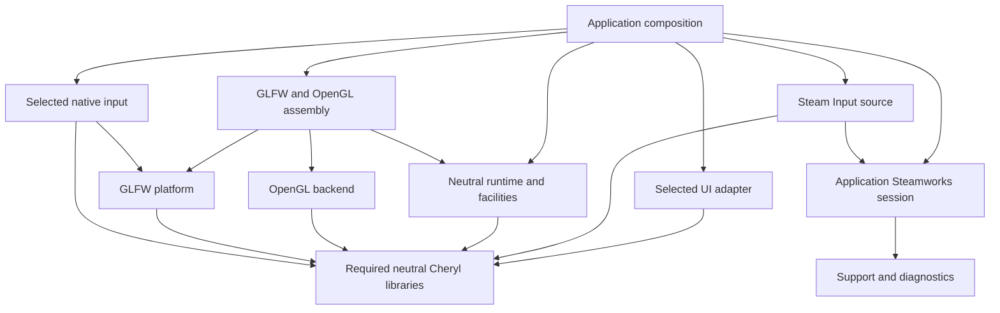

# Subsystem libraries and optional modules

Status: architecture review and implementation plan. Reviewed against 7a1dff4 on
2026-10-03. The owner requested a thorough review before creating the skeleton.
This document proposes build and ownership boundaries; none of the new targets,
options, service hooks or input-source APIs below exists yet. No configuration,
compilation or executable tests were run for this review.

## Direction and scope

Make Cheryl a set of composable libraries. Keep reusable contracts and coordination
in neutral libraries; put concrete graphics/platform/input implementations and
optional UI/Steam facilities in independently selected modules. Applications choose
compatible implementations and own their lifetimes. Each meaningful boundary has
its own CMake definition, public interface, implementation dependencies and tests.

Start in this repository. Establish the dependency and test boundaries before
moving repositories. A module can later become a companion repository without
assuming that it is checked out inside the engine. The existing
[UI strategy](cheryl-ui-integration-plan.md#9-module-and-dependency-structure)
already anticipates optional adapters followed by possible repository extraction.

Here, a module means an ordinary linked library. Runtime discovery/loading,
a universal Module base class, C++ language modules and a stable plugin ABI are
separate designs. They are not prerequisites for this work. In particular,
CMake's `MODULE` library type describes a runtime-loaded plugin rather than the
ordinary linked library intended here. Use STATIC/INTERFACE targets initially,
according to whether the component owns compiled code.
[CMake library types](https://cmake.org/cmake/help/latest/manual/cmake-buildsystem.7.html#module-libraries)

The immediate deliverable after this review is a small build skeleton, followed
by coherent extraction units. It does not select a UI toolkit or implement Steam,
another graphics API, multiple resource domains, or a graphics-free server loop.

## What the code already supports

The public ownership boundaries are more mature than the current build layout:

| Existing seam | Evidence | Consequence |
| --- | --- | --- |
| Explicit adapter composition | [EngineContext](../../include/cheryl/core/engine/engine-context.h) accepts display, presentation, renderer, provider and owned/borrowed input interfaces. | A backend module can supply objects; runtime need not discover plugins or name a native library. |
| Generic runtime | [GameRuntime](../../src/core/game-framework/game-runtime.cpp) consumes those interfaces and immutable input/render data. | Runtime can be compiled without native graphics/window implementations. It still requires the abstract facilities that its current constructor validates. |
| Graphics context seam | [OpenGLRenderer](../../src/backends/opengl/renderer.cpp) uses [iOpenGLContext](../../include/cheryl/backends/opengl/context.h). | OpenGL rendering need not depend on GLFW; GLFW context binding belongs in a bridge. |
| Generic input delivery | [iInputSystem](../../include/cheryl/core/controls/input-interface.h), ActionSnapshot, PollSnapshot and TickInput separate collection from simulation. | Preserve these contracts while extracting native providers and adding source composition. |
| Backend resource ownership | [ResourceLifetime](../../include/cheryl/backends/opengl/resource-lifetime.h) owns native retirement/context validation. | Keep native handles and their lifetime implementation with their graphics backend. |
| Independent consumer | [tests/consumer](../../tests/consumer/CMakeLists.txt) links the actual Cheryl::Engine target. | Extend this pattern to narrower target boundaries; do not repeat engine sources or dependency lists in consumers. |

The current [root CMake](../../CMakeLists.txt) collects 69 production `.cpp` files
into `STATIC cherylGL`, with `Cheryl::Engine` as its alias. It discovers OpenGL and
adds GLFW/GLAD unconditionally, propagates GLAD publicly, and propagates Gainput in
normal configurations. Sandbox removes three native input files and X11/Gainput
requirements; it retains OpenGL and GLFW. Sandbox is not a minimal core build.

The aggregate collects 42 test `.cpp` files. Even focused logging targets link the
whole engine target. Choosing a runtime test filter avoids executing other cases,
but does not avoid compiling their translation units or configuring the engine's
native dependencies.

A static source inventory gives this first useful separation:

| Implementation slice | `.cpp` count | Current files |
| --- | ---: | --- |
| OpenGL implementation | 9 | debug-output, glslprogram, pipeline, program-builder, renderer, resource-lifetime, resource-provider, texture, vertex-array-object under src/backends/opengl |
| GLFW/OpenGL bridge | 2 | glfw-context and glfw-backend under src/backends/opengl |
| GLFW display/window | 3 | display-system, window and glfw-diagnostics under src/core/display |
| GLFW/Gainput input | 3 | input-system, input-mapper and glfw-bindings under src/core/controls |
| Other engine implementation | 52 | Neutral runtime/input/render/resource code, workers/events, diagnostics/logging, math and file/font facilities |

This excludes `src/main.cpp`, which is the existing optional signal-handler object.
The 52-file group still contains OS work such as thread affinity and system-font
discovery. Removing graphics/window/input-adapter dependencies does not make it
free of all OS code. The counts describe opportunities, not measured build savings.

## Target families and dependency direction

Use two related structures: core components that provide reusable facilities,
and modules that supply implementations or higher-level integrations. Both own
CMake targets; their dependency contracts differ. A foundational component does
not consume an aggregate that includes itself.

Proposed names are deliberately provisional until each extraction establishes its
owned headers and symbols:

| Family | Candidate target | Responsibility and dependencies |
| --- | --- | --- |
| Support | Cheryl::Support | Exceptions, bounded failure reporting, diagnostics, singleton/general utilities and logging; current CTTI/spdlog/Backward requirements. Group these initially rather than creating an archive for each small helper. |
| Memory | Cheryl::Memory | Allocation/bookkeeping/object templates and required generic numeric helpers; depends on Support. An INTERFACE target is suitable while it remains header-only. |
| Workers | Cheryl::Workers | Owned/shared worker capacity, groups and native affinity implementation; depends on Support and Threads. |
| Events | Cheryl::Events | Immediate event registry and registration/lifetime rules; depends on Support, independently of worker delivery. |
| Input contracts | Cheryl::Input | Binding/snapshot/capture/routing/accumulation/backlog behavior; depends on Support, with native providers selected separately. |
| Platform contracts | Cheryl::Platform | Window/display/presentation-facing values and interfaces, including Monitor; no GLFW implementation. |
| Rendering contracts | Cheryl::Rendering | Retained frames, draw/pipeline semantics, camera and neutral geometry/resource interfaces; no GL calls. |
| Resources/assets | Cheryl::Resources, Cheryl::Assets | Resource creation contracts versus decoding/loading/caches/manifest/font/sprite facilities. Start with a broader neutral bundle if necessary; resolve the teardown dependency described below before promising two independent targets. |
| Runtime | Cheryl::Runtime | EngineContext, GameRuntime, simulation scheduling and platform/simulation delivery coordination. Event-delivery bridges use Events/Workers without making Events depend on Runtime. |
| Neutral convenience | Cheryl::Core | Aggregate of the neutral components required for current runtime composition. Granular clients link only what they need. |
| Graphics provider | Cheryl::Graphics::OpenGL | Native rendering/resource implementation and GLAD; preserve current native link requirements until independently verified. |
| Platform provider | Cheryl::Platform::GLFW | Concrete DisplaySystem/Window, GLFW diagnostics and native event/window services. |
| Input provider | Cheryl::Input::GLFWGainput | Existing combined adapter, accurately named for both dependencies. Later source separation can introduce narrower GLFW and Gainput providers. |
| Context bridge | Cheryl::Integration::GLFWOpenGL | Context/presentation binding and compatible assembly; depends on OpenGL, GLFW and neutral composition. Default owned input is a separately selected composition dependency. |
| Optional facilities | Cheryl::UI::<adapter>, Cheryl::Steamworks, Cheryl::Input::Steam | Toolkit integrations, application Steam session/services and Steam input translation. Each takes narrow neutral dependencies. |
| Compatibility | Cheryl::Engine / cherylGL | Existing complete configuration for target consumers during migration; built above components/providers, never used as their foundational dependency. |

The first Core extraction can keep the 52 neutral files together. Fine component
extraction should follow actual test/consumer needs, rather than require every row
to be independent before the first benefit. In particular, resources and assets
currently have a real dependency cycle to repair.

This diagram shows ownership groups, not an assertion that every module links the
entire Core aggregate:



Dependency rules:

- Lower libraries do not link Runtime, the legacy Engine aggregate, UI or Steam.
- Provider implementations depend on neutral contracts; neutral contracts do not
  depend on their providers. Bridges explicitly depend on both sides they join.
- Headers exposing dependency types require PUBLIC usage requirements. PRIVATE
  implementation dependencies still need correct final static linking; PRIVATE
  is not a promise that the library disappears from a consuming executable.
- Every production source and process-state implementation has one owner target.
  Do not compile shared logger/cache/registry implementations into both Core and
  the compatibility engine or into multiple adapters.
- Keep one propagated logging compile policy across every component and consumer.
  Module writes select explicit named logs, preserving the default-independence
  contract established by the logging continuation.

These build-scope rules follow
[CMake target linking](https://cmake.org/cmake/help/latest/command/target_link_libraries.html).
Support ownership must keep emergency reporting independent of ordinary logging.

## Compatibility and repository layout

The supported [U7 contract](../development/consuming-engine.md) is build-tree
target consumption. Preserve `target_link_libraries(app PRIVATE Cheryl::Engine)`
and public source behavior for the default complete configuration during extraction.
Offer Core and granular targets for consumers deliberately selecting fewer parts.
Linking legacy Engine continues to select its native dependency graph; adding a
Core name alone does not reduce that client's build.

`cherylGL` is currently a real STATIC target, not an INTERFACE aggregate. Do not
silently change its target type or remove its explicit build target. The preferred
initial compatibility design keeps a real static facade target and records its
component link dependencies. It must own compiled source: legacy full/default-input
assembly where that dependency direction is appropriate, or a deliberate internal
archive anchor. Keep borrowed bridge assembly independently owned. Linking child
targets alone cannot create this facade archive. This preserves target consumption
and build selection, but does not preserve a flattened archive of every implementation.
Whether external consumers require that raw archive is an explicit M2 checkpoint.
If they do, specify and validate an artifact solution before changing that contract.
Linking child static libraries does not merge their objects into the parent's
archive. [CMake static-library behavior](https://cmake.org/cmake/help/latest/manual/cmake-buildsystem.7.html#static-libraries)

Retain existing header paths at first. Moving ownership to another target does not
require immediately moving every header/source physically. Legacy core.h,
controls.h, display.h and opengl.h umbrellas continue to mean their existing broad
convenience surface. Neutral consumers use granular headers. Native header probes
belong to their selected module, not to every Core consumer.

Proposed eventual layout:

```text
cheryl-engine/
  CMakeLists.txt                  # Composition and compatibility entry point
  cmake/                         # Component selection/build helpers
  include/cheryl/                # Stable paths during migration
  src/                           # Existing implementation during ownership extraction
  components/
    support/CMakeLists.txt
    memory/CMakeLists.txt
    workers/CMakeLists.txt
    events/CMakeLists.txt
    input/CMakeLists.txt
    platform/CMakeLists.txt
    rendering/CMakeLists.txt
    resources/CMakeLists.txt
    runtime/CMakeLists.txt
  modules/
    platform/glfw/
    graphics/opengl/
    input/glfw-gainput/
    integration/glfw-opengl/
    services/steamworks/
    input/steam/
    ui/<selected-adapter>/
```

Each populated module owns CMakeLists.txt, include/, src/, tests/, optional examples/
and any helpers required for its standalone build. The directory list describes
destinations; the skeleton should not create empty exported APIs for all of them.
Create the build convention and an inert template first, then populate a module
when its dependency contract is ready. No toolkit is selected by a directory name.

Modules initially remain in this repository, outside the current recursive src
glob. Later a game/workspace can compose separate engine and module repositories
with submodules, explicit source paths or pinned fetched dependencies. A standalone
module means independently configurable with its dependencies supplied, rather
than having no dependencies. Avoid an engine-submodules-modules-submodules-engine
checkout cycle. A separate repository should be justified by independent consumers,
release/version ownership or distribution needs, rather than used to manufacture
a code boundary that CMake has not yet established.

## CMake contract for the subsequent skeleton

Keep source acquisition, component selection and target definition distinct:

1. A composition root chooses components and resolves dependencies once.
2. A component/module CMake definition creates only its owned targets and required
   test/example targets, using explicit source lists.
3. A module's standalone entry point supplies the required Cheryl targets before
   including that same target definition.

A standalone module first reuses already-supplied required targets. Otherwise it
accepts an explicit `CHERYL_ENGINE_SOURCE` checkout path with a separate binary
directory. It must not assume `../../..` locates the engine, copy the engine's
include/link lists, or compile engine `.cpp` files itself. If required Cheryl targets
are missing from an existing graph, do not bootstrap a second source engine or mix
different installations to fill the gaps. Later component packages may load further
components from the same installed Cheryl package. The initial
skeleton can use today's Engine target; it must document that this still inherits
native dependencies until M2 creates Core. Do not alias Core to the old Engine and
advertise a dependency reduction that has not happened.

When the standalone entry point adds the engine, suppress the engine's optional
module catalog in that local bootstrap scope. Otherwise the engine could recursively
add the module that is already being configured. Reuse existing targets for module
dependencies as well. Do not use FORCE to rewrite a host's cache choices. Helpers
needed for standalone configuration travel with the module when it is extracted;
they cannot be found through a private path into another checkout.

Proposed settings:

| Setting | Intended behavior |
| --- | --- |
| CHERYL_BUILD_MODULES | Default OFF for the first optional-facility catalog; does not replace later core/native component selection. |
| Per-module enable settings | Default OFF for new facilities; discover SDK/toolkit dependencies only inside the enabled owner. Missing requested dependencies produce an actionable configuration error. |
| Per-module BUILD_TESTS / BUILD_EXAMPLES | Standalone defaults can follow PROJECT_IS_TOP_LEVEL; embedded builds remain explicitly controlled by the host. |
| Core/native selection | Add an explicit Core-only selection independent of CHERYL_SANDBOX_BUILD. Preserve the existing full default configuration while native providers become selectable. |
| CHERYL_ENGINE_SOURCE | Explicit source checkout for standalone composition; no implicit clone or download. |
| Steam SDK path/version | Explicitly supplied only when building the real SDK implementation; private imported dependency and separately owned deployment. |

Per-module enable settings do not override logging masks or compiler standards.
Publish usage requirements through targets. Target ownership also needs a scoped
warning/sanitizer policy: current directory-wide Debug sanitizer and warning flags
must be reviewed during extraction, preserving their established behavior before
changing it. Module selection must not change C++ class layouts per translation unit.

Installed `find_package(Cheryl CONFIG ...)` is later work: component exports,
versions, relocatable include paths, legacy include spellings, dependency packages,
logging configuration and native link requirements all need their own acceptance.
Do not write a fallback to a package that the repository does not yet produce.
[CMake dependency composition](https://cmake.org/cmake/help/latest/guide/using-dependencies/index.html),
[package exports](https://cmake.org/cmake/help/latest/guide/importing-exporting/index.html),
[PROJECT_IS_TOP_LEVEL](https://cmake.org/cmake/help/latest/variable/PROJECT_IS_TOP_LEVEL.html)

## Boundaries that require work before stronger claims

### Resource teardown and generic headers

[ResourceProvider::~ResourceProvider](../../src/assets/resources/resource-provider.cpp)
directly clears the global material/sprite/tileset/font/shader/texture managers.
Assets depend on ResourceProvider, so assigning this destructor to a low-level
Resources target would create Resources -> Assets -> Resources. Keep a broader
neutral resource/asset bundle initially, or establish explicit cache/provider
registration and teardown ownership before the fine split. Evaluate a scoped
cache lifetime/release hook against the existing tests before selecting an API.
Do not introduce a second cache domain as part of moving CMake ownership.

Preserve teardown of dependent asset owners before image storage, retained logical
handles, renderer shutdown sweeping, and failure precedence. A prototype must prove
that its registration cannot call already-destroyed owners or invoke native work
from a foreign final-release thread.

[templates/block.h](../../include/cheryl/templates/block.h) includes cemath.h, which
includes anchor.h and asset vertex data. A foundational Memory target should narrow
the required numeric/helper includes or establish genuinely low-level value
ownership at this boundary. Do not propagate the accidental geometry dependency
into more components or remove unrelated public helpers during extraction.

### GLFW, input and graphics assembly

[InputSystem::poll](../../src/core/controls/input-system.cpp) currently calls
glfwPollEvents. The display interface has no event-pump operation. A display module
with injected State-only input is not automatically a working window-event service.
Specify one native pump owner and its relation to input collection: latch capture
and focus before pumping, then publish the completed poll afterwards. Initial
extraction preserves the existing bounded-poll policy. Pumping OS input while that
backlog is full would need a separate retention/overflow contract, not a hidden
behavior change. UI modules must not pump GLFW themselves.

The [GLFW/OpenGL factory](../../src/backends/opengl/glfw-backend.cpp) combines the
borrowed-input path and default Gainput-owned path in one translation unit and
includes native input unconditionally. Separate common context assembly from
default-input convenience ownership before claiming a bridge without Gainput.
GlfwOpenGLContext also reaches a private GLFW diagnostics header across directories;
give the bridge a deliberate private platform seam instead of retaining that path
as an implicit dependency. Preserve one diagnostics/callback/library lifetime owner.

Window creation currently inherits global GLFW client-API hints; the OpenGL factory
sets them. A reusable graphics-free native window service needs a creation-policy
boundary. DisplaySystem requires a real monitor/video mode, so GLFW's null platform
does not make it a headless display adapter. Portable tests keep recording displays.

Keep the current Unix X11 link requirement with the Gainput/native-input owner;
vendored Gainput does not propagate it itself. GLFW has its own platform discovery.
Do not assume all explicit X11 linkage belongs to the display target.

Extraction must preserve EngineContext's destruction order: input, provider,
renderer, surface, display. Preserve current-context and owner-thread checks,
foreign-thread logical release through retirement, and no native work through
closed/abandoned domains. Existing GLAD global entry points and one active cache
domain do not establish multiple independently active graphics domains.

### Neutral UI editing controls

DeviceButtonId is opaque/backend-defined; current native key IDs and demo editing
comparisons use Gainput values. Events/Text are already ordered and retained, but
a Core-only toolkit adapter still needs neutral editing-key identities or an
explicit key-mapping service. Keep native code/scancode metadata, committed OS text,
and layout-sensitive character input distinct. Resolve this in U9 before a UI
module imports native headers merely to translate Backspace and navigation keys.

## Steamworks and Steam Input as separate modules

### Application session and service ownership

Create an explicitly owned application Steamworks session. It owns initialization,
callback registrations, callback pumping and shutdown. Engine contexts borrow it
or attach scoped services; a context's destruction does not terminate the process
Steam lifetime. Valve documents global interfaces after initialization and callbacks
on the thread invoking SteamAPI_RunCallbacks. This motivates one chosen callback
owner and explicit listener lifetimes.
[Steamworks API overview](https://partner.steamgames.com/doc/sdk/api)

The application decides App ID, restart policy, startup failure treatment and whether
Steam is required. Return startup outcomes rather than terminate/relaunch from a
module constructor. Development identity files and runtime deployment belong to
the application. Keep SDK headers and native handles private. Add achievements,
overlay or other services only when a consumer selects them; they share the session
instead of each initializing the SDK.

Use narrow injectable operations and copied result/event values for testable logic.
Callbacks must not unwind exceptions into the SDK. Copy borrowed payloads, retain
the first failure, and report it on a safe owner-thread operation. Simulation-bound
events use an owned submission endpoint; they do not call mutable game/UI objects
on the callback thread. Registrations become inert before their consumers die.
Pending asynchronous results receive an explicit terminal/cancellation outcome
when the session quiesces, with a documented shutdown drain deadline.

Steam Input requires a separate shared session/service ownership rule for its SDK
interface. Valve's published header exposes Init(bool bExplicitlyCallRunFrame) and
documents one direct action callback registration. Prefer explicit frame advancement
to separate general Steam callbacks from admitted input collection. The Source SDK
copy is evidence of a seam, not the dependency version selected for Cheryl; pin
and inspect the supplied Steamworks SDK before using these signatures.
[Valve's published Steam Input header](https://github.com/ValveSoftware/source-sdk-2013/blob/master/src/public/steam/isteaminput.h)

### Composed input and semantic actions

Steam Input describes game-defined actions and contexts. Resolve the game's action
names to its Cheryl ActionIds; the engine does not impose a game vocabulary.
Native keyboard/mouse/text remain available alongside selected controller sources.
[Steam Input developer guide](https://partner.steamgames.com/doc/features/steam_controller/getting_started_for_devs)

Today EngineContext accepts one iInputSystem. ActionSnapshot is writable only by
InputBindings, and [publish_input](../../src/core/controls/input-interface.cpp)
publishes its own bindings. The native adapter owns device allocation, collection,
mapping and complete publication. Calling two current adapters and concatenating
snapshots is not a safe composition mechanism.

Introduce one runtime-facing composed input owner that:

1. Allocates source/device identities and owns exactly one collection transaction.
2. Latches focus/capture once, pumps the selected native collector in that scope,
   and samples admitted controller sources in a defined order.
3. Combines contributions before publication, then publishes one immutable complete
   State/Events/Text poll with a shared observed-order sequence.
4. Retains existing whole-backlog consumption and no edge/delta replay semantics.

Prefer an explicit semantic-action contribution seam for Steam's already-mapped
actions. Prototype it against a fake second source before stabilizing the API.
Virtual controls are an alternative if they materially simplify compatibility,
but must be labelled virtual and must not apply unwanted remapping/dead zones twice.
Do not make ActionSnapshot mutable to arbitrary module callers simply to merge it.

Define button OR/priority policy at the aggregate before deriving transitions:
releasing one source while another still holds an action must not release the
combined action. Define absolute-axis arbitration, relative-axis accumulation and
incompatible action-kind rejection explicitly. Preserve delivered taps without
inventing transitions between samples. Steam's inactive actions require release/
zero reconciliation, and mouse-like analog deltas differ from joystick values.
[ISteamInput data contracts](https://partner.steamgames.com/doc/api/ISteamInput)

Steam handles are 64-bit; Cheryl DeviceId is unsigned int. Keep an internal mapping,
never truncate native handles. Specify disconnect cleanup, reconnect baseline,
device enumeration and player assignment separately. The existing single gamepad_id
can remain a compatibility accessor; snapshots indexed only by ActionId do not
automatically provide per-player input.
[Valve handle declarations](https://github.com/ValveSoftware/source-sdk-2013/blob/master/src/public/steam/isteaminput.h)

Steam actions are not OS keycodes or Unicode TextEvents. Keyboard focus remains
distinct from controller/menu action-context policy. Game-selected context changes
are ordered owner-thread requests; changing the base Steam set clears its layers,
and layer order affects overrides. UI widgets must not independently race to own
that SDK stack. [Action-set layer behavior](https://partner.steamgames.com/doc/features/steam_controller/action_set_layers)

Choose native Steam actions versus emulated native controller input per source,
preserving real keyboard/mouse use. Consuming both paths for the same effective
device can double-count gameplay input; do not disable every native controller
merely because Steam is available.
[Steam gamepad emulation guidance](https://partner.steamgames.com/doc/features/steam_controller/steam_input_gamepad_emulation_bestpractices)

### Scheduling that does not depend on input capacity

Both runtime loops call input.poll only when admitted. Concurrent mode intentionally
stops input pumping when its backlog is full. Calling SteamAPI_RunCallbacks only
from Steam input polling would stall unrelated services during a slow update.

Specify an application/platform service phase with an explicit deadline and scoped
registration ownership. It progresses without a new input poll or render frame and
during permitted shutdown draining. Integrate it with existing platform/simulation
dispatch, preserving their cancellation and thread-affinity contracts. It is not
a general plugin scheduler or permission to run arbitrary simulation work there.

The first Steam input proof should use sampled State with explicit advancement
before an admitted collection. Verify that the supplied SDK's notifications outside
that phase cannot corrupt publication. Direct action-event mode is a later gate:
it needs defined source retention bounds, overflow reporting, transition ordering
and sample reconciliation. An unbounded side queue would defeat the current polling
capacity contract; suppressing general Steam callbacks is not a valid solution.
Polling-only mode promises observed samples, not every hardware transition.

### Unit and native acceptance separation

Keep translation/session policy tests independent of the Steam client. Use a small
private driver seam and SDK-free logic target; put actual SDK calls in an optional
transport implementation. Only that implementation requires the supplied SDK and
its redistributable. Compile-level SDK compatibility and real-client/controller
acceptance are separate from pure logic tests.

Required checks include startup outcomes, single lifetime owner, callback-thread
delivery, inert registrations, cancellation, action mapping, inactive releases,
repeated-held state, relative/absolute values, handle mapping, disconnects,
ordered contexts and duplicate-path policy. A small runtime integration proves
service progress under full input backlog and safe startup/shutdown. Opt-in native
checks use the application's SDK version, identity, action configuration and devices.

## Other subsystem candidates

| Candidate | Assessment | Appropriate boundary |
| --- | --- | --- |
| Logging/diagnostics | Strong first extraction and test ownership candidate. | Support library; keep one pool/named identity implementation and emergency path. It need not be optional for the runtime to be modular. |
| Memory/objects | Strong separate component after the generic-header dependency is narrowed. | Header usage target and its own allocation/lifetime tests; preserve process-state and late-release contracts. |
| Workers/native affinity | Strong owned implementation boundary. | Workers target; native affinity stays private to that facility and need not pull a display provider. |
| Event registry | Strong separation from delivery services. | Events target plus explicit worker/platform/simulation delivery bridges. |
| Input snapshots/routing | Core facility shared by alternative providers and UI. | Neutral Input target; concrete device collection is modular. |
| Graphics backend | Strong existing context/resource seam. | OpenGL module plus separate window/context bridge. Another graphics API must first check the generic draw/resource contract; extraction alone does not prove Vulkan/other API suitability. |
| Native windows/platform services | Useful provider boundary with pump/creation-policy work required. | GLFW module; keep generic Monitor/window values separate. Future clipboard/cursor/DPI capabilities remain neutral U9 contracts. |
| Image/manifest decoding and preparation | Useful CPU-only facility. | Asset preparation target with private STB/JSON dependencies; upload remains an explicit owner-thread provider operation. |
| Asset cache/loading | Useful high-level facility with current teardown/global-domain coupling. | Wider neutral bundle first; explicit cache lifetime before an independent low-level Resources target. |
| Fonts/text | Useful optional provider/facility family. | Separate CPU discovery/rasterization, resource upload and later Unicode layout as consumers require. Preserve current ASCII/font behavior; do not imply U11 is complete. |
| Tile selection | Good future independently testable facility. | U10 pure selection logic over existing definitions; current metadata/assets do not already implement autotiling. |
| Generic math/state utilities | Useful target/header ownership, often INTERFACE. | Keep data-only numeric/state contracts small; avoid one library per helper or geometry dependencies in unrelated memory headers. |
| Signal handlers | Existing explicit optional boundary. | Retain Cheryl::SignalHandlers and application ownership; module startup must not reinstall process handlers implicitly. |
| Audio/network/physics services | Potential future modules, without an implemented subsystem to extract here. | Add only for concrete consumers, following the same public contracts and private dependency rule. |

Modularity does not require making every facility replaceable at runtime. Logging,
memory and coordination can be stable core libraries; graphics/input/platform can
have alternative providers; Steam/toolkits can be optional facilities. Their useful
boundaries are ownership, dependency closure and independent acceptance.

## Tests that become smaller in substance

Give each extracted implementation its own executable linked to the real owner
target, with test-only recording helpers. Compile public headers as first includes
and add a small independent consumer for every meaningful boundary. Consumers must
not supply engine source files, private headers, duplicate dependency lists or an
ad hoc language standard.

Split mixed translation units at their ownership boundary. Current event-bus.cpp
is 875 lines and mixes registry and worker delivery; runtime-adapter.cpp is 2,369
lines and mixes runtime, uploads/caches, worker shutdown and retained rendering.
core/input.cpp has native cases behind sandbox guards, and the consumer has an
unconditional GLSLProgram header probe. Filtering those executables is not a build
split. Reuse narrow test fixtures; keep actual composition/failure ordering cases
in a dedicated integration target rather than trying to force them into leaf tests.

M2's Core-only acceptance needs a neutral consumer/header set and portable test
source selection. Separate required native probes/cases into their owner targets
at that boundary; do not wait for all M3 test splits or enable sandbox to hide them.
Keep the existing full consumer as compatibility acceptance.

The aggregate can remain a convenience entry point using owned test object targets
and one test main. Label tests by component; isolated executables own working
directories so concurrent log rotation, asset fixtures or process registries cannot
interfere. A full integration suite remains necessary for retained frames,
thread affinity, partial startup, callback ownership and shutdown ordering.

| Configuration to prove | Required outcome |
| --- | --- |
| Support/Memory/Workers/Events/Input unit targets | Build their actual required libraries without native graphics/window/device discovery. |
| Core-only normal configuration | No OpenGL/GLAD/GLFW/Gainput/X11 targets or discovery attributable to those providers; generic runtime/resource checks and an independent Core consumer use recording adapters. Sandbox is not the mechanism for this proof. |
| OpenGL with GLFW/native input OFF | Backend recording fixtures and public-header consumer work through iOpenGLContext; no GLFW/Gainput dependency. |
| GLFW with OpenGL OFF | Diagnostics/platform checks and consumer link without graphics backend; reusable native window behavior is separately accepted after pump/creation policy is settled. |
| Full compatibility configuration | Existing factory, native input, consumer and native X11/OpenGL behavior remain valid. |
| UI/Steam logic without their native transports | Fake-boundary tests compile without toolkit/SDK/client/native graphics dependencies where their logic contract permits. |
| Selected module composition | A real application links selected modules once; tests verify compatibility, callback/pump ownership, failure paths and destruction. |
| Disabled module | Its dependency discovery and source compilation are absent, rather than merely skipped during execution. |

Measure clean/incremental build time, compiled sources, discovered dependencies and
test setup cost after the first extractions. Expect smaller dependency closures;
record actual evidence before claiming a speedup. Keep finite unit tests distinct
from race-detector, real-device, native-driver and cross-platform evidence. A TSan
configuration remains separate work from the current Debug ASan/UBSan policy.

## Ordered implementation units and discovery gates

This sequence extends U9's build/integration preparation without declaring all
possible module extractions prerequisites for UI. U9's generic clipping/color/
input/platform contracts remain engine work; adapter-specific work waits for the
module boundary it uses. U10/U11 retain their original feature scope.

| Unit | Coherent work | Gate before depending on it |
| --- | --- | --- |
| M0 — architecture | This review, owned-source map, proposed targets, compatibility scope and discovered boundaries. | Review the contract, distinguish current behavior from proposed endpoints, and resolve unsupported assumptions before a skeleton implies them. |
| M1 — build skeleton | Optional module catalog, local/standalone entry-point convention, inert template and documentation. No fake UI/Steam implementations or pretend neutral Core alias. | Existing build composition stays valid; duplicate-engine, missing-source and recursion cases are checked once configuration execution is authorized. Record that today's Engine dependency remains broad. |
| M2 — neutral Core and native owners | Define explicit 52/17 source ownership, condition native dependency discovery, keep the compatibility build target with an explicit source/artifact strategy, and separate module target definitions without requiring physical relocation. Add neutral consumer/header sources and separate native test cases as needed for this gate. | Resolve raw-archive versus CMake-target compatibility before changing cherylGL; prove Core-only consumer/build closure without sandbox and preserve the existing full consumer/configuration. A neutral runtime still needs its abstract adapters. |
| M3 — focused foundational components | Extract Support, Memory, Workers, Events and Input as coherent units, starting with the easiest owner. Split their mixed tests and narrow Memory's include dependency. | Each owner has independent consumer/header/unit evidence and one process-state implementation. Do not require all fine splits before accepting the broad Core benefit. |
| M4 — resource ownership | Prototype cache/provider registration/teardown, then separate neutral resource/render contracts from high-level asset preparation/cache facilities where justified. | Preserve one active cache domain, retained resources, partial uploads and failure/destruction order. Keep the wider neutral bundle if the proposed split cannot prove these guarantees. |
| M5 — native provider composition | Prove OpenGL without GLFW; GLFW/native input ownership and Unix linkage; private diagnostics bridge; borrowed versus default-owned input assembly. | Recording/native consumer checks preserve context affinity and callbacks. Settle event-pump and window creation policy before advertising a fully independent native window service. |
| M6 — input source composition | One coordinator, identities, neutral editing-key mapping and semantic contribution policy; preserve the old iInputSystem facade and native behavior. | A fake second source plus extracted native input proves one publication, no replay, focus/capture/order, disconnects, axes and alternative held bindings. |
| M7 — service scheduling | Application-owned pump phase, deadlines, scoped registration and shutdown policy; fake service first. | Service progress under full input backlog, absent frames, failure and shutdown; no mutation of simulation objects on the platform owner. |
| M8 — first optional facilities | Neutral U9 probe/UI adapter after toolkit requirements are selected; Steamworks session and sampled Steam Input logic through narrow injected seams. Commit these independently. | UI respects generic facilities; Steam logic tests need no client; application identity and process/session lifetime remain external choices. |
| M9 — real Steam transport/native proof | Supplied pinned SDK, private transport, deployment and opt-in application/controller acceptance. | Verify explicit frame advancement and callback timing, action config, duplicate-path policy, origins and shutdown. Direct action events need a bounded retention contract before extension. |
| M10 — package/repository distribution | Component export/install/versioning, relocated module consumer and optional companion repositories. | Installed/source consumers select the same public target contract without private checkout paths or accidental native dependencies. |

M6 and M7 can proceed after the relevant Core boundary independently of fine font/
asset extraction. UI neutral correctness can proceed before Steam integration.
Steam-native acceptance is gated on a supplied SDK/application configuration,
while the architecture and fake-source work can proceed without those inputs.
Do not hide a new required contract repair inside a directory move; record it and
complete it before accumulating consumers of that unfinished boundary.

## Decisions and validation status

Established direction: ordinary linked components, in-repository ownership first,
explicit application composition, neutral contracts below concrete providers,
separate Steam session/input roles, focused owner tests plus composition acceptance,
and an external engine dependency for standalone optional modules.

Implementation checkpoints still requiring evidence: compatibility archive users,
resource release ownership, native pump/creation policy, neutral editing-key and
semantic-source interfaces, service deadlines and source queue bounds. Toolkit
choice, Steam SDK version/App ID/action config, per-player input, additional graphics
APIs and runtime plugin ABI are not inferred from this review.

Validation of this planning unit is source/CMake review, exact source inventory,
official Valve/CMake reference checks, independent review of the proposed graphs,
and local document/link/whitespace checks. The textual include scan followed 182
local files from the proposed 52-file neutral slice and found no reachable
GLFW/GLAD/Gainput/GL includes. It ignores preprocessor conditions and external
dependency internals; it does not prove compilation or final link closure.

Three independent reviews covered graphics/resources/compatibility, build/test
composition, and Steam/input semantics. Their refinements are recorded above:
compiled source for the real static facade, neutral acceptance sources at M2,
same-package component loading, and direct evidence for Steam handle width.
All 19 local links in the new plan and added documentation text resolve; whitespace
and code-fence checks pass. Prior U5–U8 acceptance retains its
recorded scope; it does not establish any proposed module build or runtime feature.
The implementation skeleton remains the next work, following this documented review.
